<a name="HOLTop"></a>
# Cross Platform Mobile Development with Xamarin #

---

<a name="Overview"></a>
## Overview ##

Creating cross-platform mobile applications can be challenging. Besides the platform differences in the code, good DevOps practices like Continuous Integration (CI) and Continuous Delivery (CD) are also challenging.

However, using [Xamarin](https://xamarin.com/) developers can build and debug native apps for iOS, Android and Windows from a single, shared C# codebase. Furthermore, developers can leverage [Visual Studio Team Services (VSTS)](https://www.visualstudio.com/en-us/products/visual-studio-team-services-vs.aspx) for source code, work item management, CI and CD for mobile applications.

### A Note About HealthClinic.Biz ###
The solution that you will use for this workshop is from [HealthClinic.biz](https://github.com/microsoft/healthclinic.biz). This is a sample repo that Microsoft created. The code has
been modified slightly for this workshop, so if you go to the GitHub repo you may find differences. The mobile apps in the project connect to two services that are hosted in Azure - an
Azure Mobile App and an Azure Web App. The Azure apps have been modified for this workshop so that they are _read only_. Any add, update or delete method will return a successful
response but will not modify any data in the backing database. If you wish to host these services yourself after the workshop, then please refer to the 
[Deployment to Azure](https://github.com/Microsoft/HealthClinic.biz/wiki/Deployment-to-Azure) page in the wiki.

<a name="Objectives"></a>
### Objectives ###
In this module, you will see how to:

- Leverage Visual Studio and Xamarin to develop cross-platform mobile applications
- Run automated tests for your application to increase agility and overall quality
- Create a new Team Project in VSTS
- Push your source code to the VSTS Team Project

<a name="Prerequisites"></a>
### Prerequisites ###

The following is required to complete this module:

- An email address for creating a new Xamarin account and VSTS account

---
<a name="Setup"></a>
### Setup ###

In order to run the exercises in this module, you will need to set up your environment first.

1. Open Windows Explorer and browse to the module's **Source** folder.
1. Right-click **Setup.ps1** and select **Run as administrator** to launch the setup process that will configure your environment and install the Source Code for this module.
1. If the User Account Control dialog box is shown, confirm the action to proceed.

<a name="Exercises"></a>
## Exercises ##
This module includes the following exercises:

1. [Sign up for a Xamarin Account](#Exercise1)
1. [Explore Xamarin Projects in Visual Studio](#Exercise2)
1. [Open the HealthClinic.Biz Xamarin Solution](#Exercise3)
1. [Create a VSTS Team Project](#Exercise4)
1. [Push the Source Code to the VSTS Team Project](#Exercise5)
1. [Run and Examine Unit Tests](#Exercise6)

Estimated time to complete this module: **60 minutes**

> **Note:** When you first start Visual Studio, you must select one of the predefined settings collections. Each predefined collection is designed to match a particular development style and determines window layouts, editor behavior, IntelliSense code snippets, and dialog box options. It is recommended that you use the **General Development Settings** collection.

<a name="Exercise1"></a>
### Exercise 1: Sign up for a Xamarin Account ###

Xamarin provides developers with tools to manage cross-platform applications. Xamarin is not free - though you can use a trial account for this workshop. Developers can choose to run the standalone [Xamarin Studio](https://xamarin.com/studio) (which runs on Windows or Mac) or use Visual Studio with the [Xamarin Visual Studio Tools](https://xamarin.com/visual-studio).

In this workshop you will be using Xamarin Visual Studio Tools, though the concepts work just as well in Xamarin Studio.

Xamarin provides many benefits:
- A single tool to manage mobile apps across iOS, Android and Windows
- Share application logic across all platforms
- Leverage existing C# skills
- 100% coverage of all APIs across all platforms - anything you can do in Objective-C, Swift or Java can be done in C# with Xamarin
- Native performance as Xamarin compiles C# code to native apps

In this exercise, you will create a Xamarin account that you will use for the remainder of this workshop. You will then open the source code, enter your Xamarin credentials and compile the projects.

<a name="Ex1Task1"></a>
#### Task 1 - Create a Xamarin Account ####

In this task, you will create a Xamarin account.

1. Navigate to the [Xamarin Store](https://store.xamarin.com/login "Xamarin Store login") and click the **Create a new account** link:.
  > **Note**: If you have a Xamarin business license you can use it and skip this exercise.

	

	_Xamarin Store Login screen_

1. Fill in a name, email address and password. Make a note of the password, since you will need this in a later exercise. Make sure you check both checkboxes and then click **Register**.

    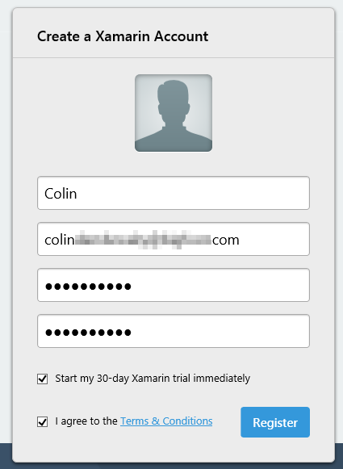

    _Create a new Xamarin account_

    > **Note**: If you get a "validation failed" error, it probably means that your password is not strong enough. Make sure your password is at least 12 characters long.

<a name="Ex1Task2"></a>
#### Task 2 - Activate your Xamarin Account in Visual Studio ####

In this task, you will activate your Xamarin Account in Visual Studio.

1. Start Visual Studio. In the Tools menu, click **Xamarin Account...**.

    

    _Xamarin Account in the Tools Menu_

1. Click **Log In** and enter your Xamarin credentials.

    

    _Xamarin Login in Visual Studio_  

1. Enter the email address and password that you used for creating your Xamarin account in [Task 1](#Ex1Task1) and press **Login**.

    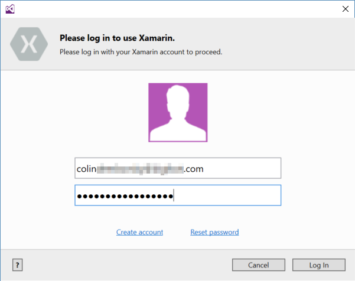

    _Xamarin Credentials in Visual Studio_  

1. Once activated, you should see your account has been logged in. You can close the dialog.

    

    _Logged in to Xamarin in Visual Studio_

<a name="Exercise2"></a>
### Exercise 2: Explore Xamarin Projects in Visual Studio ###

In this exercise, you will explore Xamarin projects in Visual Studio.

<a name="Ex2Task1"></a>
#### Task 1 - Exploring Xamarin Project Types ####

In this task you will learn about different types of Xamarin projects.

1. In Visual Studio, click **File->New->Project** to launch the new project dialog. Click the **Cross Platform** node to see the cross-platform project templates.

    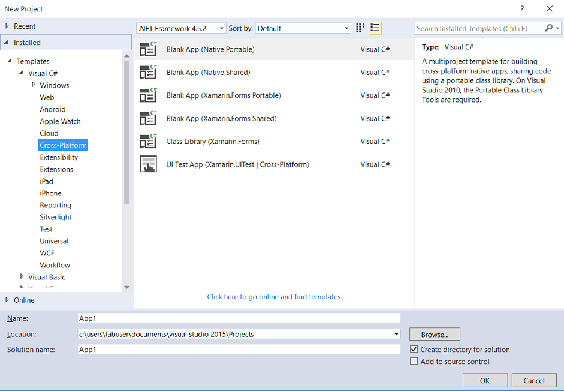

    _Visual Studio Cross Platform Project Templates_

    Here are some of the project templates.

    - Native Portable - use this to share binaries between native projects.
    - Native Shared - use this to share source code between native projects.
    - Xamarin.Forms Portable - use this to share Xamarin Forms binaries between projects
    - Xamarin.Forms Shared - use this to share Xamarin Forms code between projects
    - Xamarin.Forms class library - use this to create a Xamarin Forms class library
    - Xamarin UI Test App (Cross Platform) - use this to create a cross-platform UI test project

    Under the iOS and Android nodes, you'll see a UI Test App template for iOS and Android respectively. These are used to create Xamarin platform-specific UI test projects.

    > **Note**: The difference between a shared project and a portable project is the unit of sharing. Portable projects share compile code (binaries) while shared projects share source code.

    > **Note**: Portable class libraries allow you to share code - this is typically business logic code, and not UI code. However, Xamarin.Forms allows you to share even UI code. In Xamarin.Forms, you would design a page with controls that have been abstracted. Xamarin.Forms maps the abstracted Forms controls to native controls - so Xamarin.Forms Entry control maps to UITextView on iOS, EditText on Android and TextBox on Windows.

    The [Xamarin.Forms](https://xamarin.com/forms) site describes which Xamarin approach is best for your app.

    - Xamarin.Forms is best for:
        - Apps that require little platform-specific functionality
        - Apps where code sharing is more important than custom UI
        - Developers comfortable with XAML
    - Xamarin.iOS & Xamarin.Android are best for:
        - Apps with interactions that require native behavior
        - Apps that use many platform-specific APIs
        - Apps where custom UI is more important than code sharing

<a name="Exercise3"></a>
### Exercise 3: Open and Compile the HealthClinic.Biz Xamarin Solution ###

In this exercise, you will open the cross-platform mobile apps for the [HealthClinic.biz](https://github.com/microsoft/healthclinic.biz) project. You will examine the project structure and compile the solution. You will run the application in the UWP simulator and the Android emulator.

> **Note**: While most of the code is the same for this workshop as the code in the GitHub repo, there are some differences. You will not see exactly the same code if you open the GitHub repo yourself after the workshop.

<a name="Ex3Task1"></a>
#### Task 1 - Open the HealthClinic.Biz Xamarin Solution ####

In this task you will open the Xamarin solution for cross-mobile apps for HealthClinic.biz and activate your Xamarin Business trial license.

1. In Visual Studio, click **File->Open->Project/Solution**. Browse to **c:\buildworkshop\HealthClinic.biz** and open **04_Demos_NativeXamarinApps.sln**.

1. Once the solution is open, you may be prompted to configure a Xamarin Mac agent. Since we don't have one for the workshop, you can check the **Don't show this again** checkbox and click **OK**.

    

    _The Xamarin Mac Agent Dialog_

    > **Note**: In order to compile Xamarin.iOS projects, you will need a Mac agent running on a Mac machine. Every time you open the solution, you will be prompted to connect to your Mac agent - since you won't have one for this workshop, you can just close the dialog.

1. You should see 8 projects in the solution.

    

    _Xamarin Projects in the Solution_

1. Click **Build->Build Solution** to build the solution. (You can also use **Ctrl+Shift+B** or **F6** depending on your Visual Studio Settings). The build should fail. The error message will indicate that the project is too large and requires business or higher license.

    

    _Build failure requiring Xamarin Business Edition_

1. **Double click the error**. This will launch the Xamarin license dialog. Click **Begin a Trial** to begin a trial of the Business edition of Xamarin.

    

    _Select Begin a Trial_

1. Once the trial has been activated, you will see a confirmation dialog, click **Close**.

    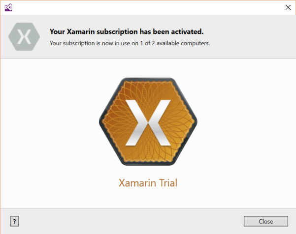

    _Xamarin Business Trail confirmation_

1. Now clean and rebuild the solution. Ensure that the solution builds without errors. This may take a few moments, since Visual Studio will need to restore components and packages that the projects require.

    > **Note**: If you see the error `The name 'InitializeComponent' does not exist in the current context` you may safely ignore it.

    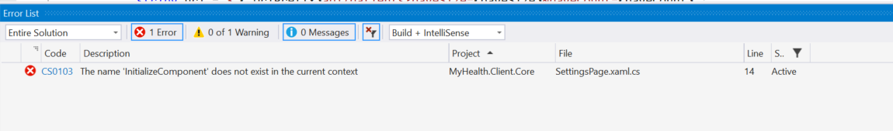

    _Ignore the InitializeComponent error_

1. Let's examine the Portable Class Library. The **MyHealth.Client.Core** project is a **Portable Class Library (PCL)**. It contains components that are shared by the Android and iOS applications in this solution as well as the Windows Presentation Foundation (WPF) desktop application and the Windows Universal Platform (UWP) app. This is the bulk of the code for the application. The other projects are more platform specific, and largely consist of wiring up the objects (like ViewModels) from the PCL to the native UI pages.

    In the project you will see:

    - **Converters** - used to convert values when databinding
    - **Extensions** - extension methods that extend existing classes
    - **Helpers** - helper functions
    - **Messages** - classes to encapsulate messages
    - **Models** - classes for encapsulating data for data binding
    - **Pages** - contains a Xamarin.Forms settings page that is used by all the platforms
    - **ServiceAgents** - encapsulates calls to the REST services that the app connects to
    - **Services** - interfaces for common services used in the apps
    - **ViewModels** - view models from the MVVM pattern, used for data binding in the UI
    - **AppSettings.cs** - a static file containing common settings

    The advantage of having a PCL is that there is so much reuse of the code. It also makes unit testing simpler, since .NET unit tests can be used to test the logic in the PCL, thereby ensuring quality of the large common base of the code.

1. Examine how the **AppointmentsViewModel** is reused in several projects. Open the following file: **MyHealth.Client.Core\ViewModels\AppointmentsViewModel.cs**. This class defines the view model for the appointments page in the app. It defines several properties that raise property changed events when they are modified and several list properties that are **Observable** - that is, they also raise events when they are modified. This object can be used for databinding to controls in any UI that understands data binding. Furthermore, the class defines several **Commands** that can be triggered from UI elements such as buttons. Finally, it defines how the data is retrieved from the data store via services.

1. Open the following files and see how this **ViewModel** is reused in the other projects:

    - **MyHealth.Client.Droid\Views\AppointmentsFragment.cs**
    - **MyHealth.Client.iOS\Views\AppointmentsView.cs**
    - **MyHealth.Client.W10.UWP\Views\AppointmentsView.xaml.cs**

    All of the above files define the **AppointmentsViewModel** as the data binding source for the UI. The remainder of the code in the platform-specific projects is to configure and bind the object correctly to UI elements.

1. Now, let's examine the **ServiceAgents**. The Client applications all call a service to get and update data. The service is an ASP.NET 5 REST API application hosted in an **Azure Mobile App** service. The Service Agents are encapsulations of different "areas" within the API: for example, the **DoctorsService** contains calls to the methods that get Doctor data, while the **PatientsService** gets Patient data.

    The source code for the service is in the source structure (you can see it if you open the **06_Demos_MobileApp.sln** solution). For this workshop, the service has already been deployed to Azure at this address: [https://healthclinicmobile-build.azurewebsites.net](https://healthclinicmobile-build.azurewebsites.net). Deploying this service is beyond the scope of this workshop.

    > **Note**: [Azure Mobile Apps](https://azure.microsoft.com/en-us/services/app-service/mobile/) can be used for:
    > 
    > - Broadcasting push with customer segmentation
    > - Enterprise single sign-on with Active Directory
    > - Autoscaling to support millions of devices
    > - Allowing apps to work offline and sync
    > - Social integration with Facebook, Twitter, Google

    In later tasks, you will mock the services so that unit tests do not have any dependency on the services. However, when you run the applications in the emulators, they will connect to the service in Azure.

<a name="Ex3Task2"></a>
#### Task 2 - Run the UWP and Android Emulators ####

In this task, you will run the Android and UWP applications in their respective emulators. You will set a breakpoint and confirm that Visual Studio breaks at the code even when it is running in the emulators.

> **Note**: It is also possible to debug iOS applications in exactly the same manner as debugging UWP or Android applications. However, to do so you require a Mac to be connected (via the Mac agent).

1. Open **MyHealth.Client.Core\ServiceAgents\PatientsService.cs** and set a breakpoint at the return statement in the `GetAsync(int id)` method. You can do this by clicking the breakpoint gutter on the left or by placing the cursor on the line and pressing **F9**.

    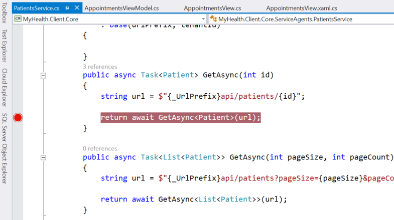

    _Setting a breakpoint in the PatientsService_

1. Right-click the **MyHealth.Client.W10.UWP** project and click **Set as Startup Project**. In the Toolbar, click the **Run in Simulator**.

    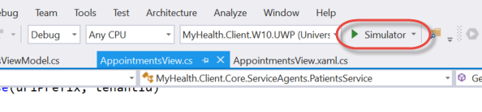

    _The Run UWP Simulator button_

    > **Note**: if the button does not say **Simulator** then click the dropdown menu on the right of the button and click **Simulator**. If you do, you can see the other run options you have for UWP applications.

1. The application should launch in the simulator.

    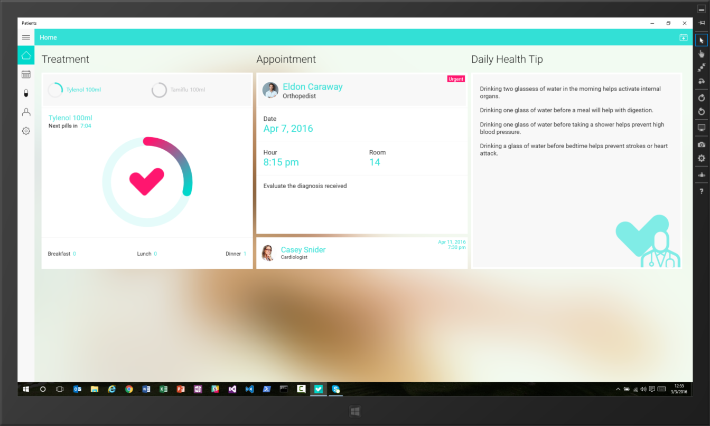

    _The Patient app running in the UWP Simulator_

    > **Note**: If the simulator is small, simply drag it to enlarge the view.

1. Now click the **hamburger** menu icon on the top left of the app and then click the **User** menu item.

    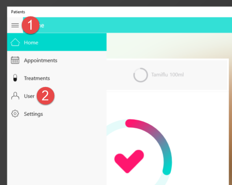

    _The Patient User menu item_

1. You should now see the debugger break in the **PatientsService** class at the breakpoint you set. Press **F5** to continue running the application.

    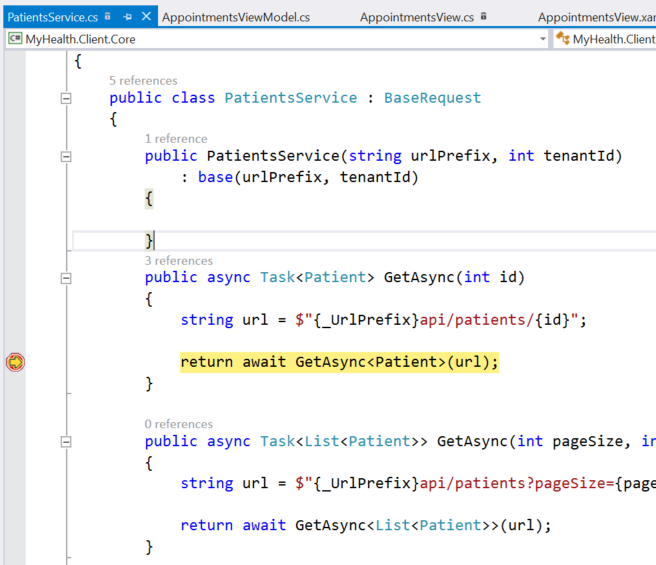

    _The Visual Studio debugger breaking_

1. When you want to stop debugging, you can click the Stop button in the toolbar.

    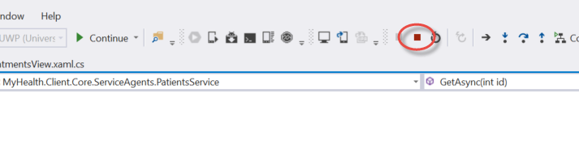

    _The Stop Debugging button_

1. Now, let's run the Android App in the Android Emulator. Right-click the **MyHealth.Client.Droid** project and click **Set as Startup Project**. In the toolbar, click **Run in Simulator**, which should have a name like **5" KitKat (4.4) XXHDPI Phone (Android 4.4 - API 19)**.

    

    _Click Run Android Emulator_

1. The first time you do so, the emulator is created and configured, so it may take a few moments to start up. Once it starts up, you should see the emulator run the **Patients** app.

    

    _App in the Android Emulator_

1. Confirm that the debugger breaks in the **PatientsService.cs** file as it did in the UWP emulator. Press **F5** to continue running the app. When you are done, click **Stop** to stop debugging.

<a name="Exercise4"></a>
### Exercise 4: Create a VSTS Team Project ###

In this exercise, you sign up for a VSTS account and create a new Team Project. Later you will push the source code to this Team Project. You will also use the Team Project in later modules to create an automated build that runs unit tests and produces binaries, create a release definition to manage releases of your builds and track work items like bugs.

<a name="Ex4Task1"></a>
#### Task 1 - Sign up for a VSTS Account ####

In this task, you will sign up for a free VSTS account.

> **Note**: You can skip this step if you already have a VSTS account. However, you need to ensure that it is an account in which you are the account owner. In other words, if you create the account yourself, you can skip this step and just sign into your account. However, if some else created the account and added you to the account, then you will need to complete this step. Once you have signed into your existing account, then create a new Team Project as specified in [Task 2](#Ex4Task2).

1. Sign into [visualstudio.com](https://go.microsoft.com/fwlink/?LinkId=307137). Enter your Microsoft Account credentials.

    

    _Signing into visualstudio.com_

    > **Note**: If you do not have a Microsoft Account, then you will need to create one by clicking "Sign up now". Once you have created an account, you can sign in using that account.

1. Create a new VSTS account by entering the following information:

    - Your name
    - Your region
    - The name of your new account
    - Click **Create Account**

    

    _Creating a New VSTS Account_

    > **Note**: You can change your email address and region if you want to.    

1. Once the account is created, you will see the VSTS landing page, which will prompt you to create a new Team Project. Continue to the next task.

<a name="Ex4Task2"></a>
#### Task 2 - Create a New Team Project ####

In this task, you will create a new Team Project.

1. On the **New Team Project** page, enter the following information:

    - A project name - the workshop will use _HealthClinic_, so it is recommended that you use this too
    - Select the **Agile** process template
    - Select **Git** version control
    - Click **Create project** button

    

    _Creating a New Team Project_

    > **Note**: This workshop will use the Agile template, but could just as easily use the Scrum template. Similarly, you could use Team Foundation Version Control as well, but this workshop will use Git. In other words, these choices do not affect the ability to do cross-platform mobile app development or DevOps.

1. Once the Team Project is created, you will be redirected to the Team Project dashboard. You can close the Congratulations dialog once you have read it.

    

    _The Team Project Dashboard_

<a name="Exercise5"></a>
### Exercise 5: Push the Source Code to the VSTS Team Project ###

In this exercise, you will push the source code to your VSTS Team Project. Once the code is in the team project, you will branch it.

<a name="Ex5Task1"></a>
#### Task 1 - Initialize the Local Repo ####

In this task, you will initialize a local Git repo for your source code. Since there is more code in the repository than just the solution you have open, you will use the command line to initialize the repo.

> **Note**: The local repository contains the complete history of the source code. If other developers obtain your repo (in Git language, if they _clone_ your repo) they will see all the history of the source in their local copy. Typically, the Git workflow is: you _commit_ your changes to your local repo and then _push_ the changes to a remote repo. Other developers would then _pull_ your changes into their local repo before _committing_ and _pushing_ their changes.

1. Press the **Start** button in the Taskbar (or press the Windows key on your keyboard) and type in **dev**. Find the **Developer Command Prompt for VS2015** and click it to launch the developer command prompt.

    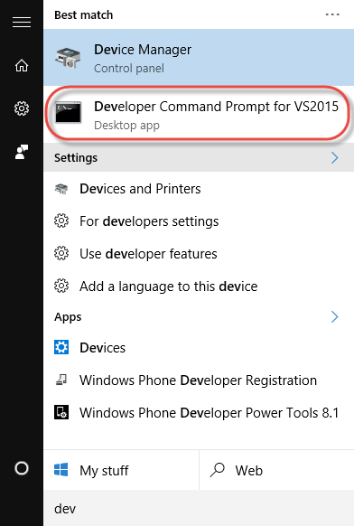

    _Open the Developer Command Prompt_

1. The Developer Command Prompt should open.

    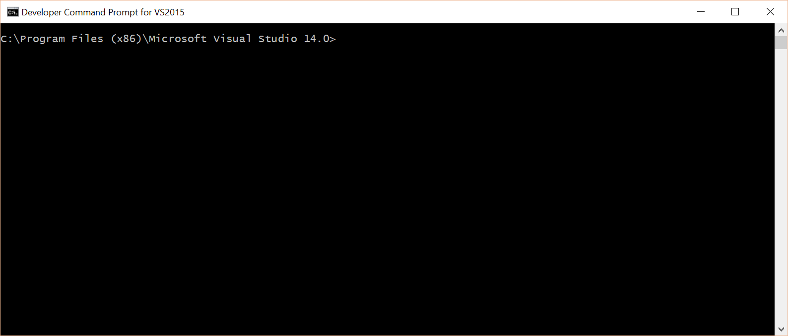

    _The Developer Command Prompt_

1. Enter the following command. This will change the directory to the root folder containing the source code.

    ```
    cd c:\buildworkshop\HealthClinic.biz
    ```  

1. Now enter the following command. This will initialize the Git repo. The response should be `Initialized empty Git repository in C:/buildworkshop/HealthClinic.biz/.git/`

	> **Note**: This initializes the repository and places the current version onto the `master` branch. The name `master` is simply a convention, but it is a well-used one.

    ```
    git init
    ```

1. You'll connect to the newly initialized repo in Visual Studio. Click **View->Team Explorer** and then, **Connect** (it looks like a little plug).

    > **Note**: This task could be accomplished from the command line too. Feel free to run `git add .` and `git commit -m "Initial commit"` from the command line if you are familiar with using Git from the command line. Then skip to the [next task](Ex5Task3).

    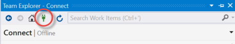

    _The Connect button in Team Explorer_

1. At the bottom of the Pane, find the section with the heading **Local Git Repositories**. Click the **Add** link, enter (or browse to) **c:\buildworkshop\HealthClinic.biz** and click **Add**.

    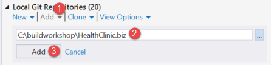

    _Adding a Git repo in Team Explorer_

1. Double-click on the newly added **HealthClinic.biz** repo to connect to the repo. Team Explorer should now list all the solutions in the repo in the **Home** pane.

    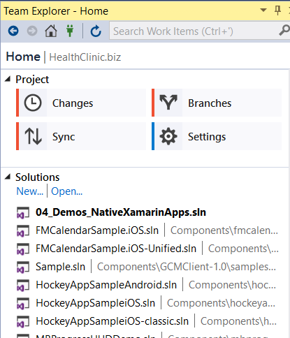

    _The Home Pane in Team Explorer_

1. Click on the **Changes** tile to navigate to the Changes pane. Expand the **Untracked Files** section to see the files that Git has detected are not yet tracked. In order to track these files, you must first _add_ them to the repo.

1. Right-click the top node and click **Add**.

    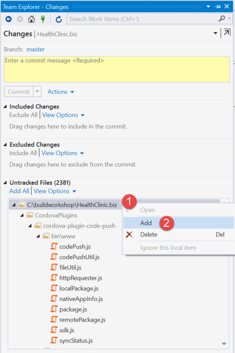

    _Add untracked files in Team Explorer_

1. The files have now been places in the **Included Changes** section. You are now ready to _commit_ the files to the repo. Enter **Initial commit** into the message box and click the **Commit** button.

    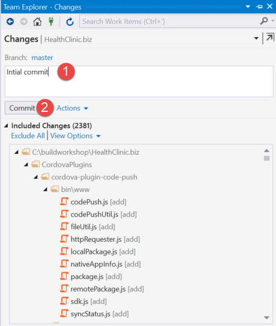

    _The initial commit_

1. This may take a few moments. Once completed, the **Changes** pane will show no changes pending.

    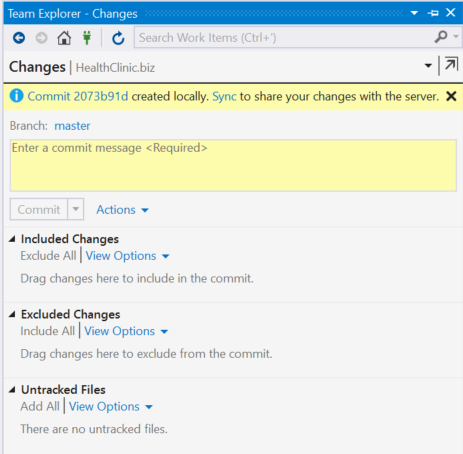

    _No changes in Team Explorer_

<a name="Ex5Task2"></a>
#### Task 2 - Push the Code to the VSTS Repo ####

In this task, you will add the **remote** - that is, a repo that other developers (and processes like builds) can **pull** code from. While the entire source history lives in your local Git repo, you will have to share your code somehow for others to read and change it. The _unit of sharing_ (if you will) is the **remote** repo.

> **Note**: Repositories can have any number of remotes. Once you have committed to your local repo, you will **push** the changes to a remote (or many remotes).

1. Let's find the Git remote address from the repo in VSTS. Navigate to your VSTS **HealthClinic** Team Project. Click on the **CODE** hub.

    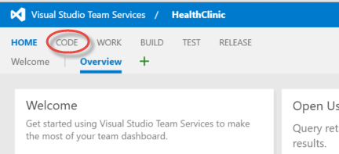

    _Click on the Code Hub_

1. Find the Clone URL and copy it to the clipboard.

    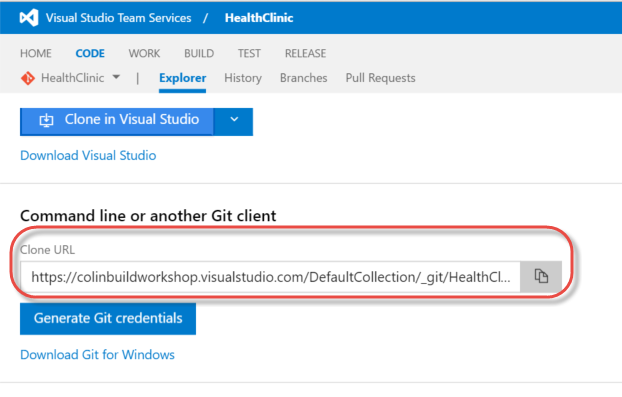

    _Getting the Clone URL in VSTS_

1. Configure your **Git Global Settings**. Go back to Visual Studio, open the **Team Explorer** window, connect to the **HealthClinic.biz** repo if you are not already connected. Click on the Pane heading to pull down the navigation menu. Click **Settings**.

    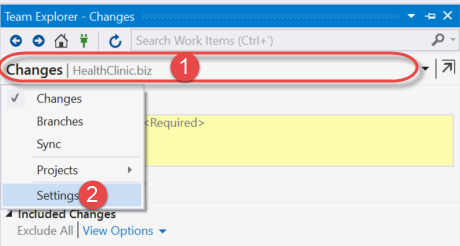

    _Navigating to Settings in Team Explorer_

1. Click **Global Settings**. Enter your name and email address. Leave the other settings as their defaults.

    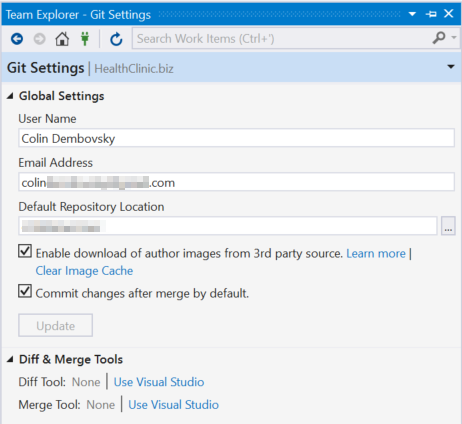

    _Global Git Settings in Team Explorer_

    > **Note**: This is not an authentication setting. The username and email address are text fields that are associated with commits. In order to _push_ your code to a remote, you typically have to authenticate against the remote server. You will see this later.

1. Now let's add a Remote. Again click on the Pane heading to pull down the navigation menu and click **Settings**. Then click **Repository Settings**. Under **Remotes**, click the **Add** link.

    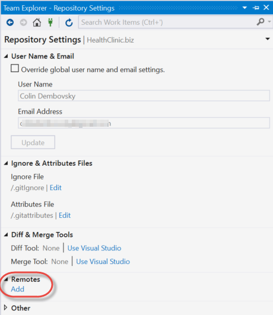

    _Click Add Remote in the Repo Settings Pane_

1. Enter **origin** as the name of the remote and then paste the clone URL you copied from VSTS into the **Fetch** text box. Make sure that **Push matches fetch** is selected. Click **Save**.

    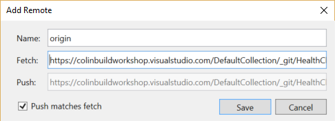

    _Configure the origin remote_

    > **Note**: The name `origin` is again a convention that is very commonly used. The remotes can be named whatever you want, but typically if you only have one remote the name of that remote is `origin`.

1. Now push the code to VSTS. In **Team Explorer**, click on the Pane heading to pull down the navigation menu and click **Sync** to open the Sync pane.

1. Under **Outgoing Commits**, click the **Publish** link.

    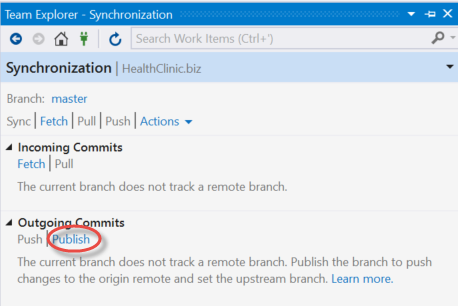

    _Publish to the remote_

1. You will be prompted to enter credentials. Enter the username and password of the MSA account that you used to create your VSTS account.

    

    _Entering credentials when pushing to the remote_

    > **Note**: Typically, you will use the Sync Pane to _fetch_, _pull_ and _push_. You only need to publish the first time since this is the first time you are pushing to the remote. _Fetch_ allows you to preview incoming changes. If you want to pull down the changes (merging into your current workspace) you will have to perform a _pull_. If there are _conflicts_ (which will happen if someone changed a file in the remote repo that you have also changed in your local repo) you will have to resolve the conflicts. Once you've made changes via _commits_ in your local repo, you can _push_ those commits to the remote server. _Sync_ is a convenience operation that performs a _pull_ followed immediately by a _push_ (assuming there are no conflicts in the _pull_ operation).

1. Wait until the following message appears. This may take a few moments to complete.

    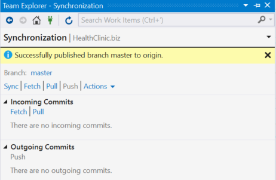

    _Successful push to the remote_

1. If you open the **Solution Explorer**, you will see padlock icons next to all the files. The **Solution Explorer** understands source control, and at present all the files are unchanged in the repo.

    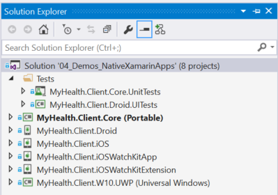

    _Source Control icons in Solution Explorer_

1. View the **CODE** Hub in VSTS. Navigate to your VSTS **HealthClinic** Team Project. Click on the **CODE** hub (or refresh the page if you are already there). You should see the code on the master branch.

    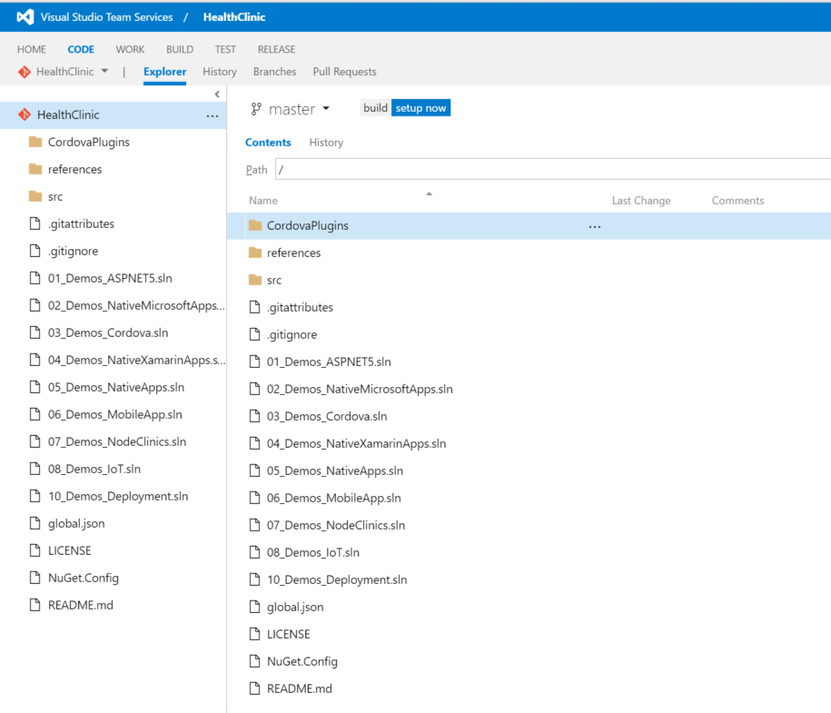

    _The code pushed to VSTS_

<a name="Exercise6"></a>
### Exercise 6: Run and Examine Unit Tests ###

In this exercise, you will run unit tests against the **Client.Core** library. You will explore the architecture of the unit tests and how to write tests against hard-to-test code. You will also learn how to mock service references for unit testing. You will also see how to calculate code coverage for a solution.

<a name="Ex6Task1"></a>
#### Task 1 - Run Unit Tests ####

In this task, you will run the unit tests.

1. Open the **Test Explorer** window by clicking **Test->Windows->Test Explorer**. When the Test Explorer Window is open, build your solution by pressing **ctrl-shift-b** or pressing **F6**. As the solution builds, the Test Explorer window will discover tests in the solution.

    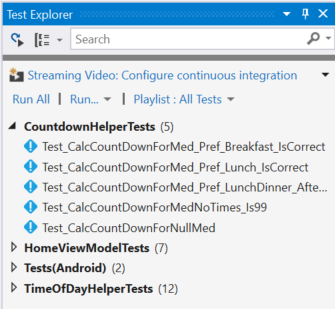

    _Tests discovered in the Test Explorer_

1. Click the **Group by** pulldown menu and select **Project** to group the tests by project.

    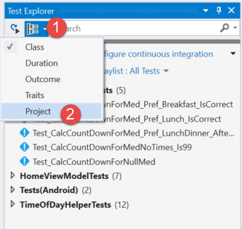

    _Group Tests by Project_

1. You will see that there are two test projects: a unit test project which contains unit tests and a UITests project that contains UI tests.

    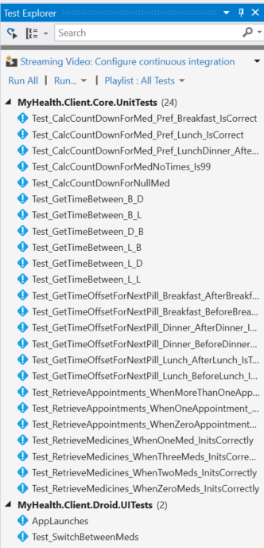

    _Tests grouped by project_

1. Right-click the **MyHealth.Client.Core.UnitTests** project and select **Run Selected Tests**. This will just run the unit tests.

    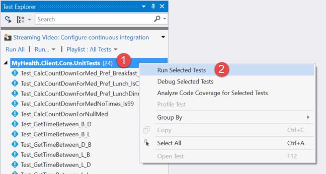

    _Run the unit tests_
    
    You should see a test failure - you will fix this later.
    
    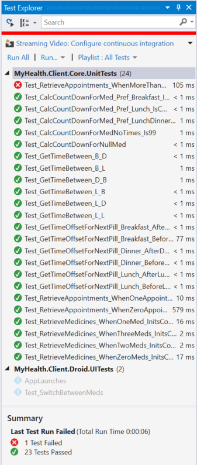
    
    _Test Results with a failure_
    
<a name="Ex6Task2"></a>
#### Task 2 - Run Tests with Code Coverage ####

In this task you will analyze the code coverage for the unit tests.

1. In the **Test Explorer** window, click the **MyHealth.Client.Core.UnitTests** project and select **Analyze Code Coverage for Selected Tests**. This runs the unit tests again, but this time calculates how much of the code is touched while the tests are running.

1. When the run is complete, you will see the Code Coverage Results window pop up. If it does not, you can open it by clicking **Test->Windows->Code Coverage Results**.

    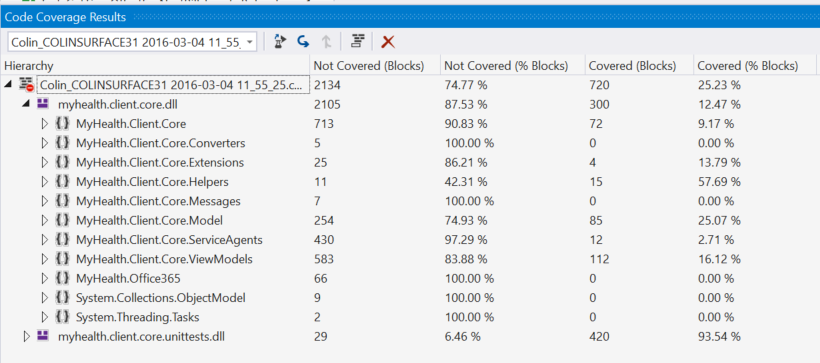

    _Code Coverage results_

1. Expand **myhealth.client.core.dll** and examine the coverage results. You will examine the unit tests in more detail later.

<a name="Ex6Task3"></a>
#### Task 3 - Run UI Tests ####

In this task, you will run UI tests.

1. In the **Test Explorer** window, expand the **MyHealth.Client.Core.UITests** project, right-click the **Test_SwitchBetweenMeds** test and click **Run Selected Tests**. This test should launch the emulator and run tests against the emulated device. The test should succeed.

    > **Note**: If the emulator starts and shows a padlock (the phone is locked) just click and drag the lock off to the right to unlock the emulator.

1. In the **Test Explorer** window, expand the **MyHealth.Client.Core.UITests** project and double-click the **Test_SwitchBetweenMeds** test to open it.

    This code uses the `IApp` interface from the **Xamarin.UITest** framework. This interface abstracts away the actual hardware (or emulator) so it can be used to run iOS UI tests as well. The `TestFixture` attribute at the top of the class specifies which platform(s) to run tests against. Since we don't have any Mac hardware, the iOS test platform has been commented out.

    ````C#
    [TestFixture(Platform.Android)]
    //[TestFixture(Platform.iOS)]
    public class Tests
    ````

    The `Setup` attribute above the `BeforeEachTest` method tells the test framework to run this method prior to each test. The method initializes the `IApp` interface.

    ````C#
    [SetUp]
    public void BeforeEachTest()
    {
        app = AppInitializer.StartApp(platform);
    }
    ````

1. Examine the **Test_SwitchBetweenMeds** method.

    ````C#
    [Test]
    public void Test_SwitchBetweenMeds()
    {
        app.Screenshot("Med1");
        app.WaitForElement(q => q.Marked("toolbar_title").Text("Home"), "Home screen too slow", TimeSpan.FromMinutes(2));
        app.Flash(q => q.Marked("countdown_title").Text("Tylenol 100ml"));

        app.Tap(q => q.Button("medicine2Button"));
        app.Screenshot("Med2");
        app.Flash(q => q.Marked("countdown_title").Text("Tamiflu 100ml"));

        app.Tap(q => q.Button("medicine1Button"));
        app.Screenshot("Med1-again");
        app.Flash(q => q.Marked("countdown_title").Text("Tylenol 100ml"));
    }
    ````

    The test uses the following methods:
    - `Screenshot` marks discreet steps in the test
    - `WaitForElement` waits for a condition to be fulfilled, with an optional timeout setting
    - The condition for `WaitForElement` is an `AppQuery` lambda. The expression `q => q.Marked("toolbar_title").Text("Home")` can be read "find the control with the name `toolbar_title` that has the text property `Home`"
    - `Flash` uses an `AppQuery` lambda to find a control and make it blink (or flash) in the UI. If you watch the test running, you will see the medicine names flash as this method finds the controls
    - `Tap` is used to tap a control or point - specified by another `AppQuery` lambda

<a name="Ex6Task4"></a>
#### Task 4 - Fakes ####

In this task, you will examine how Fakes are used to test hard to test code in the **Client.Core** project.

1. Open the **Test_CalcCountDownForMed_Pref_Breakfast_IsCorrect** test.

1. In the **Test Explorer** window, find the **Test_CalcCountDownForMed_Pref_Breakfast_IsCorrect** test in the **MyHealth.Client.Core.UnitTests** project and double click it to open the test. You will now follow the methods this test invokes to understand why it is written as it is. You will then come back and examine this method in more detail.

1. Examine the **MedicineWithDoses** and **TimeOfDayHelper** classes. Put your cursor on the **CalcCountDownValue** method call (line 11 in the above snippet). Then press **F12** to go to the definition of this method.

    ````C#
    public static int CalcCountDownValue(MedicineWithDoses medicine)
    {
        if (medicine == null)
            return 0;

        var previousDoseTime = medicine.PreviousDoseTime;
        var nextDoseTime = medicine.NextDoseTime;
        var totalTime = TimeOfDayHelper.GetTimeBetween(previousDoseTime, nextDoseTime);
        var remainingTime = TimeOfDayHelper.GetTimeOffsetForNextPill(medicine.NextDoseTime);
        var countDown = ((int)remainingTime.TotalMinutes * 100) /
            (int)totalTime.TotalMinutes;

        return countDown > CountDownMaxValue ? CountDownMaxValue : countDown;
    }
    ````

1. This method invokes the **GetTimeBetween** and **GetTimeOffsetForNextPill** methods of the **TimeOfDayHelper** class. Place the cursor on **GetTimeOffsetForNextPill** and again click **F12** to go to its definition.

    ````C#
    public static TimeSpan GetTimeOffsetForNextPill (TimeOfDay timeOfDay)
    {
        var currentDateTime = DateTime.Now;
        var breakfastForToday = new DateTime(
            currentDateTime.Year, currentDateTime.Month, currentDateTime.Day,
            BreakfastHour, 0, 0);
        var lunchForToday = new DateTime(
            currentDateTime.Year, currentDateTime.Month, currentDateTime.Day,
            LunchHour, 0, 0);
        var dinnerForToday = new DateTime(
            currentDateTime.Year, currentDateTime.Month, currentDateTime.Day,
            DinnerHour, 0, 0);
        TimeSpan timeOffset;
        DateTime nextTake;
    ````

    You can see how this method uses **DateTime.Now**. This makes this method hard to test, since the **DateTime.Now** method returns a different time every time a test invokes the **GetTimeOffsetForNextPill** method.

1. Set a breakpoint on the line `var currentDateTime = DateTime.Now;` line (line 3 above). You'll hit this shortly.

1. Examine how Fakes are used to intercept `DateTime.Now` calls.

1. Open the **Test_CalcCountDownForMed_Pref_Breakfast_IsCorrect** method again by clicking the Navigate Back button twice in the toolbar, or double-clicking the test in the **Test Explorer** window.

    ````C#
    [TestMethod]
    public void Test_CalcCountDownForMed_Pref_Breakfast_IsCorrect()
    {
        using (ShimsContext.Create())
        {
            var time = new DateTime(2016, 2, 25, 16, 0, 0);
            ShimDateTime.NowGet = () => time;

            var medWithDoses = new MedicineWithDoses(new Medicine(), () => time);
            medWithDoses.AddDoseTime(TimeOfDay.Breakfast);
            var count = CountdownHelper.CalcCountDownValue(medWithDoses);
            Assert.AreEqual(66, count);
        }
    }
    ````

    The test creates a **ShimsContext** (in the **using** statement in line 4 above). This context allows you to intercept calls to methods. You can see an intercept in these lines:

    ````C#
    var time = new DateTime(2016, 2, 25, 16, 0, 0);
    ShimDateTime.NowGet = () => time;
    ````

    When a Fake is generated for the **DateTime** class (you'll see shortly how to do this) a **Shim** class is created to _shim_ concrete methods. (_Stubs_ are also created to _stub_ out interfaces). The test uses the _shim_ to inject code to calls to the concrete method. In this case, the _shim_ is for the **DateTime** class (hence the name **ShimDateTime**). The method to intercept is the **NowGetter** - or the **get** method of the **Now** property. This code is telling the runtime to look for calls to **DateTime.Now** and to intercept the calls, injecting the lambda supplied - in this case, return **time** which is set to a well-known time.

    This makes testing any code that calls **DateTime.Now** much easier, since the test knows the value that this call is going to return. This only works within the context of the **ShimsContext**.

1. In the **Test Explorer** window, right-click the **Test_CalcCountDownForMed_Pref_Breakfast_IsCorrect** method and click **Debug Selected Tests**. The test should start and then break on the breakpoint you set earlier in the **DayOfTimeHelper.GetTimeOffsetForNextPill** method.

1. Press **F11** to step into the call. You should be brought back to the **Test_CalcCountDownForMed_Pref_Breakfast_IsCorrect** method into the lambda supplied for the **NowGet**.

    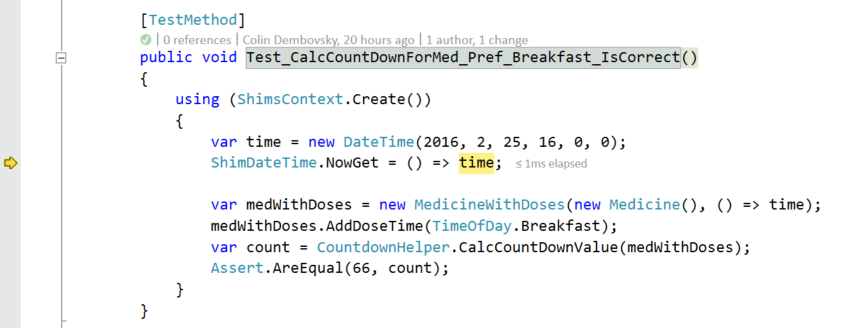

    _Breaking at the Fakes lambda_

1. Press **F10** to return the **time** object. Back in the **GetTimeOffsetForNextPill** method, click **F10** again. Mouse over the **currentDateTime** variable and confirm that the value is `2/25/2016 4:00:00 PM` - the value that was set in the **Shim**.

    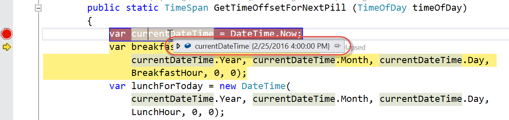

    _The DateTime.Now value set by a Fake_

1. Press **F5** to complete the test.

1. The **ShimDateTime** is created when a Fakes assembly is created for a real assembly. To see how to create a Fakes assembly, open the **Solution explorer** and expand the **MyHealth.Client.Core.UnitTests** project in the **Tests** folder. Then expand the **References** node.

1. Right-click the reference to **System** to see the **Add Fakes** menu item. This has already been done, so do not press it.

    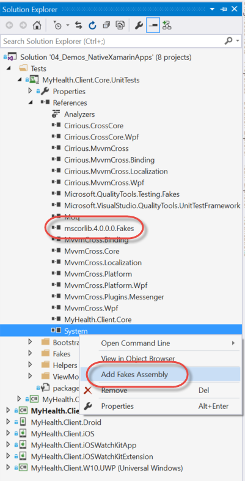

    _Creating a Fakes assembly_

1. You will also see the reference to `mscorlib.4.0.0.0.Fakes` which contains the Fake shims and stubs for **System** classes.

    > **Note**: Because **System** is a rather large assembly, you have to _white list_ fakes that you want Visual Studio to create. You can see the configuration files for **mscorlib** and **System** in the Fakes folder of the unit test project. Typically, each assembly that you Fake will have its own configuration - but again, **System** is a special case: when you Fake **System**, it fakes both **System** and **mscorlib**. The reason that you only see `mscorlib.4.0.0.0.Fakes` and not `System.4.0.0.0.Fakes` is that **DateTime** is defined in the **mscorlib** assembly.

<a name="Ex6Task5"></a>
#### Task 5 - Mocks ####

In this task, you will examine how mocks are used to isolate the unit tests from dependencies - like services.

1. In the **Test Explorer** window, find the **Test_RetrieveMedicines_WhenTwoMeds_InitsCorrectly** test and double click it to open it.

1. Have a look at the _act_ section of this test.

    ````C#
    // act
    var homeviewModel = new HomeViewModel(mockHealthClient.Object, mockMessenger.Object);
    await homeviewModel.RetrieveMedecinesAsync();
    ````

1. This code is testing that the **RetrieveMedecinesAsync** method in the **HomeViewModel** class is correct. Place your cursor on the **RetrieveMedecinesAsync** method call and press **F12** to go to its definition.

1. Examine the **HomeviewModel.RetrieveMedecinesAsync** method. This method calls a REST method on the **MedicinesService**.

    ````C#
    var medicines = await _myHealthClient.MedicinesService.GetMedicinesWithDosesAsync (AppSettings.DefaultPatientId, AmountOfMedicines);
    ````

1. Set a breakpoint on this line of code, which you'll later hit when debugging the test.

    > **Note**: The call to the service is asynchronous, so the `await` keyword is used. If you look back at the unit test, you'll see that the unit test is an `async` method so that it can properly test asynchronous code.

1. Calling the actual service during a test would be a bad idea - the returned data could change, and the test would break. It is best proactive to _isolate_ your unit tests from external dependencies - like services or databases. There are several ways to do this, but one good way is to use _mocks_.

1. Open the **Test_RetrieveMedicines_WhenTwoMeds_InitsCorrectly** method again by clicking the **Navigate Back** button once in the toolbar, or double-clicking the test in the **Test Explorer** window.

1. Examine the `arrange` section of this test (if it is folder, click the `+` icon on the left to open the folded section).

    ````C#
    #region arrange
    Mock<MedicinesService> mockMedicineService = GetMockMedicineService(2);

    var mockHealthClient = new Mock<IMyHealthClient>();
    mockHealthClient.Setup(h => h.MedicinesService).Returns(mockMedicineService.Object);

    var mockMessenger = new Mock<IMvxMessenger>();
    #endregion
    ````    

    > **Note**: This test project uses [Moq](https://github.com/Moq/moq4/wiki/Quickstart) to create mocks. There are other mocking frameworks such as [Rhino Mocks](https://www.hibernatingrhinos.com/oss/rhino-mocks).

1. The test first creates a **Mock** of type **MedicinesService** by calling the helper method **GetMockMedicineService**. Put your cursor onto the **GetMockMedicineService** call and press **F12** to navigate to its definition.

  	````C#
    private static Mock<MedicinesService> GetMockMedicineService(int numMeds)
    {
        var list = new List<MedicineWithDoses>();
        for (int i = 0; i < numMeds;)
        {
            list.Add(new MedicineWithDoses()
                {
                    Medicine = new Medicine() { MedicineId = ++i },
                    Times = new Dictionary<TimeOfDay, int>() { { TimeOfDay.Breakfast, 1 } }
                }
            );
        }
        var mockAppointmentService = new Mock<MedicinesService>("url", 1);
        mockAppointmentService.Setup(m => m.GetMedicinesWithDosesAsync(It.IsAny<int>(), It.IsAny<int>()))
            .ReturnsAsync(list);
        return mockAppointmentService;
    }
    ````

    This method first creates a **List** of **MedicineWithDoses**. Then, it creates a `Mock<MedicinesService>`, invoking the constructor with 2 arguments.

    Next, the code uses the **Setup** method to _set up_ an asynchronous value of **list** whenever the **GetMedicinesWithDosesAsync** method is called on the **Mock**. The return value will be the same irrespective of the arguments passed to the method (which is expecting 2 integer arguments).

    > **Note**: The `It.IsAny<int>()` method calls mean "for any integer in this argument". You could call `Setup` several times and return different return values if the arguments are different. For example, you could return null when the arguments are 0 and 5 respectively by using this snippet.

    > ````C#
    mockAppointmentService.Setup(m => m.GetMedicinesWithDosesAsync(It.Is<int>(0), It.Is<int>(5))).ReturnsAsync(null);
    ````

1. Go back to the **Test_RetrieveMedicines_WhenTwoMeds_InitsCorrectly** method. Once the test has a `Mock<MedicinesService>`, it needs to mock the **IMyHealthClient**. This interface is injected into **HomeViewModel** and has a getter method that returns an instance of **MedicinesService**. The code now creates a `Mock<IMyHealthClient>` to ensure that when the test is run, the **MedicinesService** returned in this call is the `Mock<MedicinesService>`.

    ````C#
    var mockHealthClient = new Mock<IMyHealthClient>();
    mockHealthClient.Setup(h => h.MedicinesService).Returns(mockMedicineService.Object);
    ````

1. Note how the **Setup** method is used to make sure that any call to the `IMyHealthClient.MedicinesService` property returns the `Mock<MedicinesService>`.

    The final piece to arrange is to create a `Mock<IMvxMessenger>` class. The constructor of the **HomeViewModel** requires an instance of the **IMvxMessenger** interface. There is no setup for this mock since there is no need to mock calls on that interface during this particular test. After the call to **RetrieveMedecinesAsync**, various assertions are made to test the validity of the method.

    > **Note**: It is possible to test if a method on a mock that has been **Setup** has been called (or how many times it was called, or with what arguments it was called) using the Moq `Validate<T>` method. It is not necessary for this test.

1. Right-click the **Test_RetrieveMedicines_WhenTwoMeds_InitsCorrectly** test in the Test Explorer window and click **Debug Selected Test**. When the breakpoint is hit in **HomeViewModel**, press **F10** to step over the call to **_myHealthClient.MedicinesService.GetMedicinesWithDosesAsync**. Then hover over the **medicines** object to see its value.

    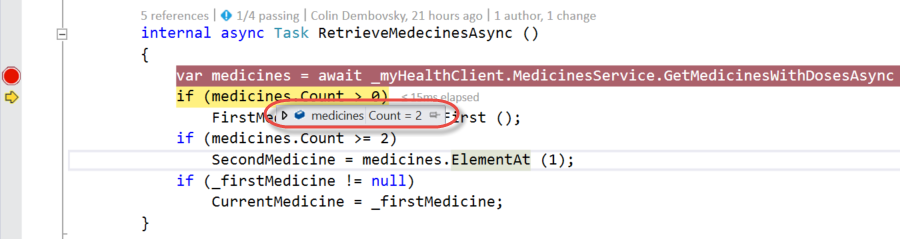

    _The results of the call to the Mock method_

1. If you expand the objects, you'll see that they are the objects that were created in the **GetMockMedicineService** helper method in the test.

---

<a name="Summary"></a>
## Summary ##

By completing this module, you should have:

- Signed up for a Xamarin Account
- Explored Xamarin Projects in Visual Studio
- Opened the HealthClinic.Biz Xamarin Solution
- Created a VSTS Team Project
- Pushed the Source Code to the VSTS Team Project
- Run and understood Unit Tests
