<a name="HOLTop" ></a>
# Mobile DevOps 2 - Continuous Integration using Visual Studio Team Services #

---

<a name="Overview" ></a>
## Overview ##

Continuous Integration (CI) is one of the key practices of DevOps. It requires the team to have a mindset to merge all working copies of developers’ code with a shared mainline, producing a new build upon code commit. The build not only compiles the code, but ideally runs code analysis, unit (and sometimes even integration) tests. This provides the team with rapid feedback on the quality of the code just committed. The CI build can even package the code so that it is ready for continuous deployment to test, QA or even Production environments. This module covers how to do that for the cross platform mobile applications used  in [Module 1](../Module1-Xamarin).

In [Module 1](../Module1-Xamarin), you covered developing cross platform mobile apps using [Xamarin](https://xamarin.com/). You learned about the project structure and **Portable Class Libraries** and saw how to unit test the core of the application. You then created a [Visual Studio Team Services](https://www.visualstudio.com/products/visual-studio-team-services-vs.aspx) (VSTS) Team Project and committed the code into it. Now let's see how to build and test it in an automated way.

### A Note About HealthClinic.Biz ###
The solution that you will use for this workshop is from [HealthClinic.biz](https://github.com/microsoft/healthclinic.biz), an end-to-end sample from Microsoft. The code has
been modified for this workshop, so you may find differences. The mobile apps in the project connect to two services that are hosted in Azure - an
Azure Mobile App service and an Azure Web App. The Azure apps have been modified for this workshop so that they are _read only_. Any add, update or delete method will return a successful
response but will not modify any data in the database. If you wish to host these services yourself after the workshop, then please refer to the
[Deployment to Azure](https://github.com/Microsoft/HealthClinic.biz/wiki/Deployment-to-Azure) page in the wiki.

<a name="Objectives" ></a>
### Objectives ###
In this module, you will see how to:

- Create a CI build for the Xamarin cross platform application in VSTS
- Analyze test results for a build
- Log rich bugs from test failures
- Trigger a build by committing code to the repo
- Improve the versioning of the compiled app

<a name="Prerequisites"></a>
### Prerequisites ###

The following is required to complete this module:

- An email address for creating a new VSTS account (you will skip this if you have already done Module 1)

<a name="Setup" ></a>
### Setup ###

> **Note**: If you have completed Module 1, you can skip the set up and go straight to [Exercise 1](#Exercise1). However, if you logged off the machine you used for Module 1 (or are using a different machine), then your work will have been deleted and you will need to run go complete the following setup tasks:
>- [Run the setup script](#SetupTask3)
>
> You will then be able to proceed to [Exercise 1](#Exercise1)

#### Sign up for a VSTS Account ####

Before continuing, you must sign up for a free VSTS account.

<a name="SetupTask1"></a>
#### Setup Task 1 - Creating a New VSTS Account ####

In this setup task, you will create a new VSTS account.

> **Note**: If you have completed Module 1, or if you already have a VSTS account that you created, you can skip this step and go to [Setup Task 2](#SetupTask2). However, you need to ensure that it is an account in which you are the account owner.

1. Sign into [visualstudio.com](https://go.microsoft.com/fwlink/?LinkId=307137). Enter your Microsoft Account credentials.

    

    _Signing into visualstudio.com_

    > **Note**: If you do not have a Microsoft Account, then you will need to create one by clicking **Sign up now**. Once you have created an account, you can sign in using that account.

1. Create a new VSTS account. Enter the following information.

    - Your name
    - Your region
    - The name of your new account
    - Click the **Create Account** button

    

    _Creating a New VSTS Account_

    > **Note**: You can change your email address and region if you want to.    

1. Once the account is created, you will see the VSTS landing page, which will prompt you to create a new Team Project. The setup script will do this for you, so you can just go on to the next task.

<a name="SetupTask2"></a>
#### Setup Task 2 - Generating a Personal Access Token (PAT) ####

In this setup task, you will generate a Personal Access Token (PAT) which is required to run the setup script.

> **Note**: Generating PATs for API calls is best practice - the tokens can be revoked at any time, and can be scoped as required.

1. In the upper right corner of the browser, pull down the menu by clicking your name. Then click **My profile**.

    

    _Accessing My Profile page_

1. Click the **Security** tab on the left. In the **Personal Access Tokens** section, click **Add**.

    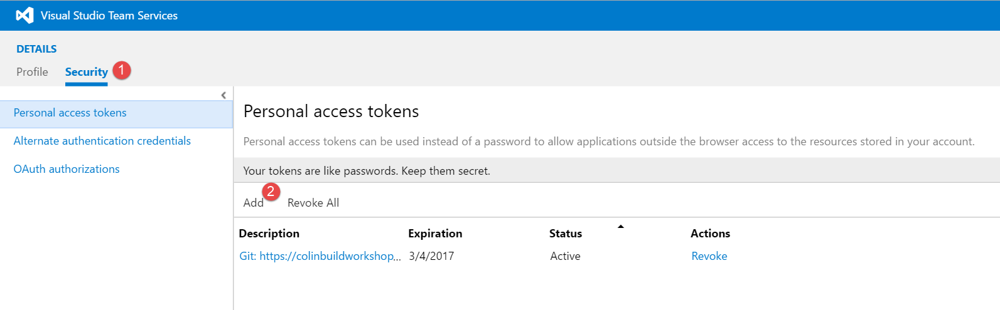

    _Click Add in the Personal Access Token section_

1. In the form, enter the name _BuildWorkshop_. Leave all the defaults and click **Create**:

    

    _Creating a PAT_

1. After the token is created, it will be displayed to you, but only once. Make a note of this access token - if you lose it you will have to create a new one.

    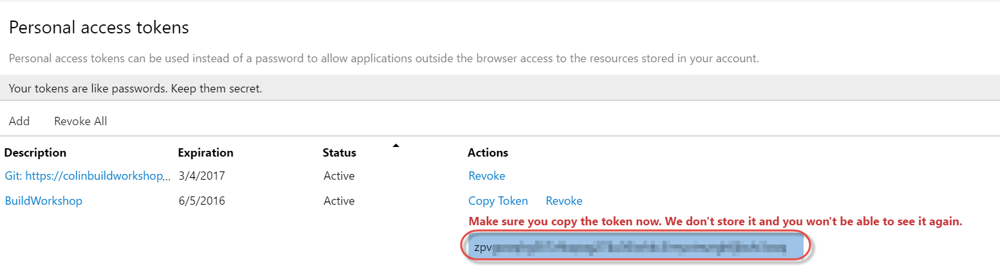

    _Copying the PAT_

<a name="SetupTask3"></a>
#### Setup Task 3 - Running the Setup Script ####

In order to run the exercises in this module, you will need to set up your environment first. **If you have completed Module 1, skip this section**.

1. Open a **Windows PowerShell** command prompt and `cd` to the Modules **Source** folder at **c:\Labs\CodeLabs-MobileDevOps\Module2-CI\Source**.

1. Enter the following command, pressing Y when prompted.

	```powershell
	Set-ExecutionPolicy Unrestricted -Scope CurrentUser
    ```

1. And then the following command.
	```powershell
    .\Setup.ps1 -vstsUrl https://{youraccount}.visualstudio.com -vstsPat {yourPAT}
	```

	Where:
	- `{youraccount}` is the VSTS account name you created earlier
	- `{yourPAT}` is the VSTS PAT you created earlier.

	> **Note**: For example, the command should look something like:
	>
	> ```powershell
	.\Setup.ps1 -vstsUrl https://colbuildworkshop.visualstudio.com -vstsPat pvzgfvhjh5fhsldfh248sl6ifyidfsdisdfs5vbchdsdffksd9hfk3qooh
	> ```

 > **Note**: If you get prompted for credentials for the origin remote, enter your Microsoft account email as the user, and paste the **VSTS PAT** as the password.

1. Wait until you see a green **Done!** before continuing.

	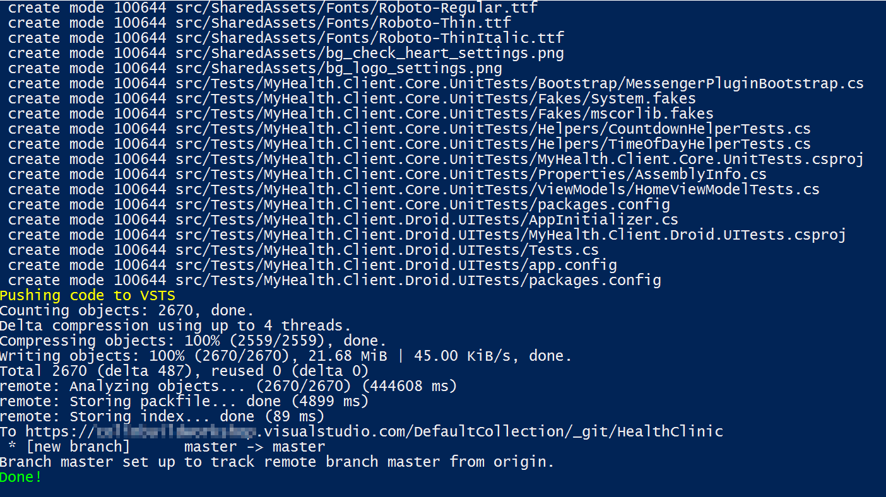

	_The Setup script completed successfully_

---

<a name="Exercises" ></a>
## Exercises ##
This module includes the following exercises:

1. [Creating a Build Definition](#Exercise1)
1. [Queueing the Build and Fix the Bug](#Exercise2)
1. [Improving Package Versioning](#Exercise3)

Estimated time to complete this module: **60 minutes**

<a name="Exercise1" ></a>
### Exercise 1: Creating a Build Definition ###

In this exercise, you will create a Build definition to compile the solution, run unit tests and package the Android application. In Module 3, you will see how to put this package into a Continuous Deployment pipeline to distribute the app code to users.

> **Note**: The build definition images below currently have Xamarin license activation steps. These are not needed anymore so please disregard those tasks in the build definition images.

<a name="Ex1Task1"></a>
#### Task 1 - Configure a Private Build Agent ####

In this task, you will install a private build agent on your local machine.

> **Note**: You could also use the Hosted build agent. The Hosted build agent spins up when a build is triggered, runs the build, and then spins down. Hosted build agents let you build without having to maintain build infrastructure. For this workshop, you will use a _private_ build agent to learn more about it.

1. Navigate to the Agent Pools configuration in VSTS
    Log in to the `HealthClinic` team project in VSTS. In the upper right corner, click the **gear** icon to open the admin page:

    

    _Click the gear icon_

1. In the top left of the navigation, click the **Control Panel** link:

    

    _Click Control Panel_

    Click on the **Agent pools** tab.

1. Download the agent
    In the left menu, click the **Download agent** button.

    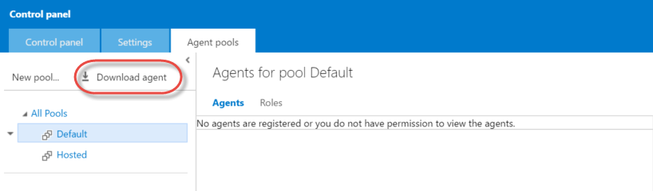

    _Click Download agent_

1. Enter `c:\buildworkshop` as the destination folder for the download. Make sure that popups are allowed from the site if nothing happens when you click the button.

    > **Note** If the browser mentions it blocked a popup, select always allow and click the Download agent link again.

1. Unlock and extract the agent.zip file

    In File Explorer, navigate to `c:\buildworkshop'. Right click the **agent.zip** file and click **Properties**. Check the **Unblock** checkbox and click **Apply**.

    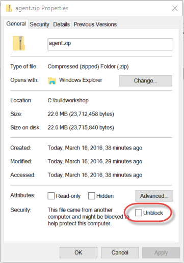

    _Unblock the agent zip file_

1. Close the properties window.

1. Right click the **agent.zip** file and select "Extract All...". Keep the default path and click **Extract**.

    

    _Extract the agent zip file_

1. Install the agent
    Once you have extracted the file, open a **Windows PowerShell** window and `cd` to `c:\buildworkshop\agent`. Then type `.\ConfigureAgent` to launch the agent configuration wizard.
    
    > **Note:** If the first prompt is **An existing configuration file was detected.  This will update the local agent settings.  Do you want to also replace the server registration (default is N)?** then you must answer **Y**. This is a previous build agent setup and your setup must replace the configuration that exists. 

1. Enter the following information for each question:
    - **Enter the name for this agent**: press enter (accept the default)
    - **Enter the URL for the Team Foundation Server**: enter your VSTS URL: (e.g. https://myaccount.visualstudio.com)
    - **Configure this agent against which agent pool?**: press enter (accept the default)
    - **Enter the path of the work folder for this agent**: press enter (accept the default)
    - **Would you like to install the agent as a Windows Service (Y/N)**: type **Y** and press enter
    - **Enter the name of the user account to use for the service**: press enter (accept the default)

    At this point you will be asked to sign into your VSTS account using your VSTS credentials.

    

    _Sign in to your VSTS account_

1. Make sure that the install completes successfully.

    

    _Successful install of the build agent_

1. Check the agent in the Default Pool on VSTS
    Go back to the **Agent Pool** page in the configuration window of your VSTS account. Click on the **Default** pool in the left menu. Make sure that the build agent is showing and is green.

    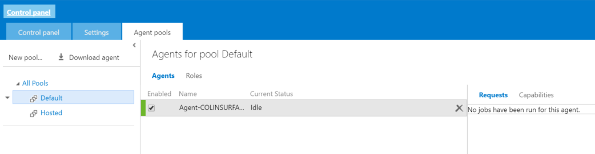

    _Agent waiting for builds_

<a name="Ex1Task2"></a>
#### Task 2 - Create the Build Definition ####

In this task, you will log in to VSTS and create a build from the **master** branch in the repo.

1. Log in to the **HealthClinic** team project in VSTS. In order to do this, open a browser and navigate to your VSTS account (something like _https://buildworkshop.visualstudio.com_). Once you are logged in, you may see a list of recently accessed Team Projects. If **HealthClinic** is listed, click the link. If it is not listed, then click the **Browse** link and select the **HealthClinic** team project.

    

    _Browsing to HealthClinic Team Project_

1. In the top menu bar, click **BUILD** to open the build hub. In the menu on the left, click the green **+** button to create a new build definition.

    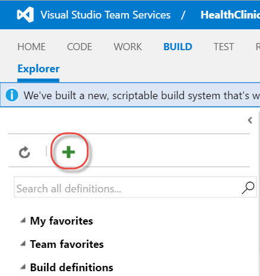

    _Click the New Build definition button_

1. Select **Visual Studio** from the list of build templates and click **Next**.

    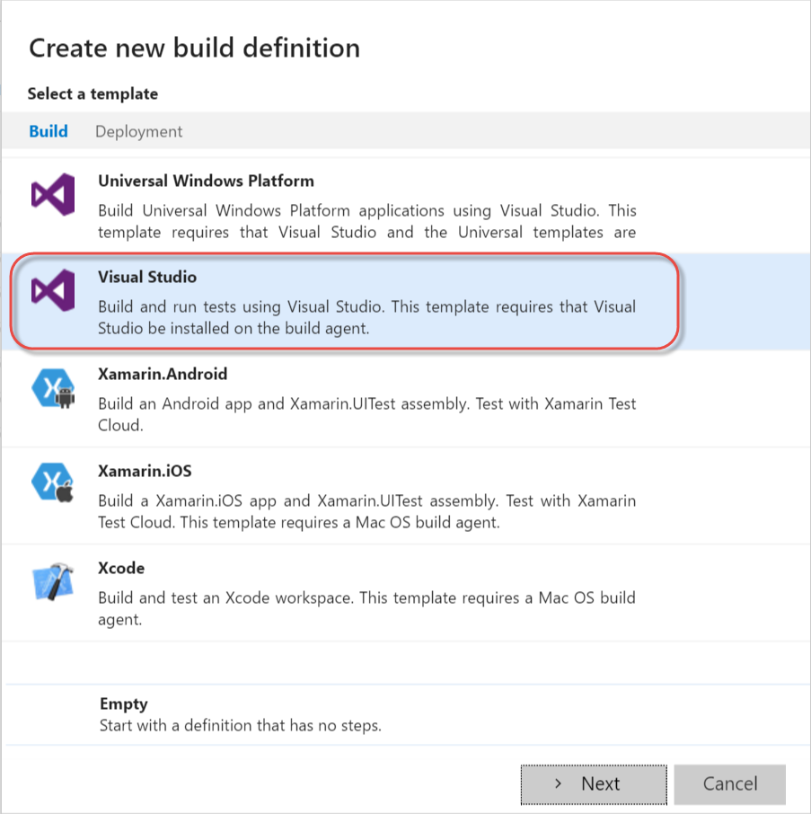

    _Select the Visual Studio build template_

    >**Note**: You will see Xamarin.Android and Xamarin.iOS build templates as well. For this workshop, you will be building multiple projects including the Portable Class Library (PCL) and the unit test project. For this reason, the Visual Studio build template is a good starting choice. Feel free to come back later and select the Xamarin templates to see how the task orchestration differs for those templates.

1. Make sure that the repo settings are correct (it should be the **master** branch on the **HealthClinic** repo). Check the **Continuous Integration** checkbox and ensure that the **Default agent queue** is set to **Default** and click **Create**.

    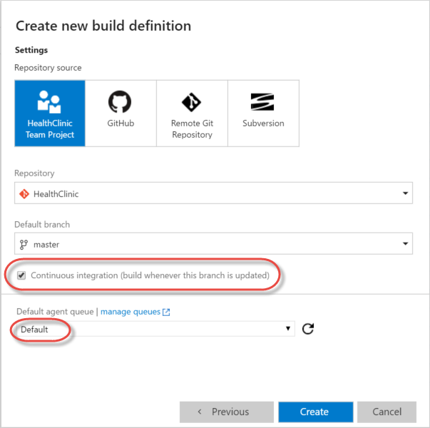

    _Build Repo and Trigger_

    >**Note**: The **Continuous Integration** trigger tells VSTS to trigger this build to run each time that code is pushed to the **master** branch.

<a name="Ex1Task3"></a>
#### Task 3 - Configure the Build Tasks ####

In this task, you will configure the Build tasks.

1. The solution requires several NuGet packages. Typically, the packages are not committed into the source repo. Therefore, the build must _restore_ the list of packages, pulling the packages from a NuGet feed. The NuGet installer task does exactly this.

    Since there are multiple solutions in the repo, you need to configure which solution NuGet should use to get the list of required packages. Click the **NuGet Installer** task. Click the **...** button to the right of the **Path to Solution** parameter.

    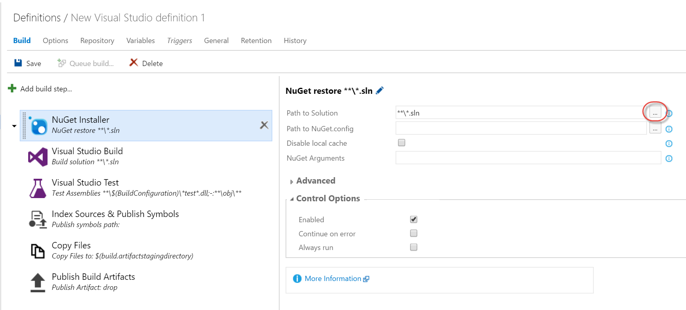

    _Browse to the Solution for NuGet_

1. Expand the **HealthClinic** node, click  **04_Demos_NativeXamarinApps.sln** and click **OK**.

    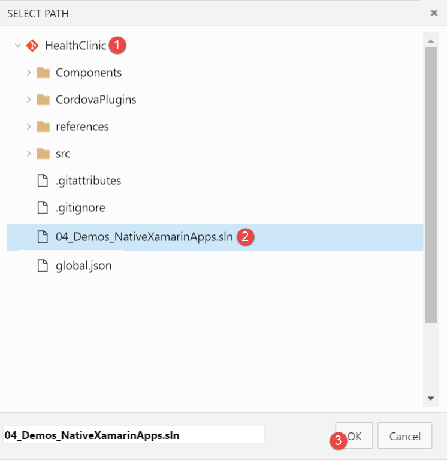

    _Selecting the solution_

1. Configure Building the solution. Back on the **Build** tab, click the **Visual Studio Build** task and update the solution to **04_Demos_NativeXamarinApps.sln** just like you did in the **Nuget Installer** task. This will build all the projects in the solution.

    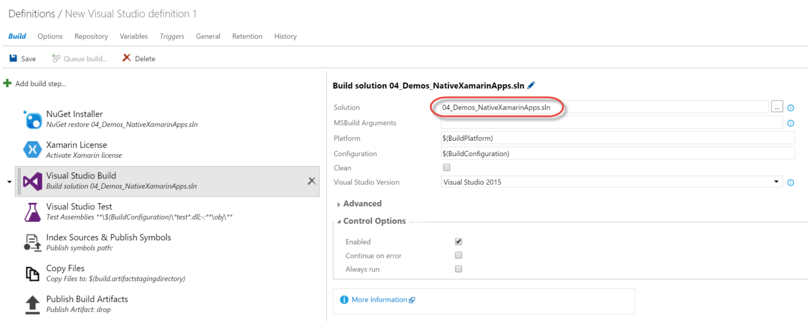

    _Build the solution_

1. Configure the Unit Test run. Click the **Visual Studio Test** task. By default, this task finds any assembly with the word `test` in it and runs the tests in that assembly. Since you have unit tests and UI tests, you will need to constrain the filter to ensure that only unit tests run during the build.

    >**Note**: It is possible to run UI tests using services like [Xamarin Test Cloud](https://xamarin.com/test-cloud) or [Perfecto Mobile](http://www.perfectomobile.com/integrations/continuous-quality-integrated-visual-studio).  These services allow you to run the tests against a myriad of devices, recording results of runs against each device. Perfecto Mobile offer 50 hours/month free for 3 Months and also provides user conditions testing, private cloud options, and the ability to execute one script (Java or C#) to test desktop and mobile browsers in parallel.  If you click **Add new task** and browse to the **Test** tasks, you will see a Xamarin Test Cloud task. You can install the Perfecto task to your account through the [VSTS Marketplace](https://marketplace.visualstudio.com/items?itemName=Perfecto.PerfectoCQ). For this lab, you will not run tests against either Xamarin Test Cloud or Perfecto’s Continuous Quality Lab, but it is possible to do so.  

1. In the **Test Assembly** parameter, change the word `test` to `unittest`, so that it only runs tests in the MyHealth.Client.Core.UnitTests project. Your task should look as follows:

    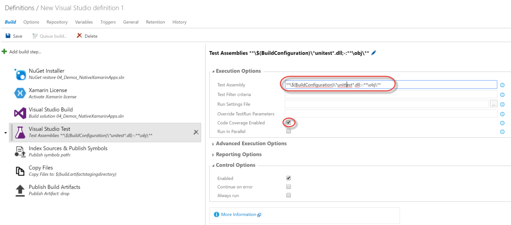

    _Configure Test Run_

1. Add a **Visual Studio Build** task to build the Android Package. When the solution builds with the existing **Visual Studio Build** task, it will only compile the Android project. In order to deploy the Android application, an **apk** file must be produced and signed. The **Xamarin.Android** projects can do this if instructed to do so. Click **Add build step...** to add a new task to the build. In the **Build** tab, find the **Visual Studio Build** task and click the Add button. Close the dialog.

1. Again the task is added at the bottom of the task list, so drag it so that it is just below the **Visual Studio Test** task.

1. Click the **...** button next to the **Solution** parameter and browse to **src/MyHealth.Client.Droid/MyHealth.Client.Droid.csproj**. Select the **csproj** file and click OK.

1. Add `/t:SignAndroidPackage` to the **MSBuild Arguments** parameter. This tells Visual Studio to produce an **apk** file and to sign it using a developer keystore.

1. Finally, type `$(BuildConfiguration)` into the **Configuration** parameter. Your task should look as follows.

    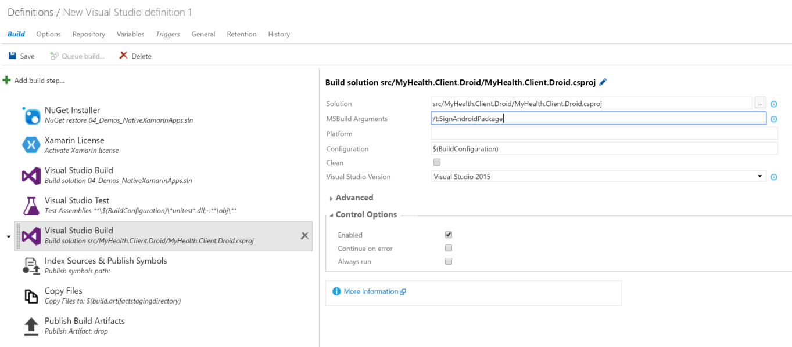

    _Configure Android Package Build_

    > **Note**: In real life scenarios, you would create a private keystore for signing your Android packages securely. You can read more about this process in this [MSDN article](https://msdn.microsoft.com/en-us/library/vs/alm/build/apps/secure-certs).

1. Configure the **Copy Files** Task. Click the **Copy Files** task. This task will copy files that we want as outputs of this build to the build artifacts staging directory. Any files in this directory will be published in the **Publish Build Artifacts** step.

1. Change the **Source Folder** parameter to be **src/MyHealth.Client.Droid**. Change the **Contents** parameter to be `**\*-signed.apk`. The **Contents** parameter supports a minimatch filter, so this value tells the task to copy any file ending with `-signed.apk` in any subdirectory of the **Source Folder** to the **Target Folder**. This is because we are only interested in the compiled and signed Android mobile app file. Your task should look as follows.

    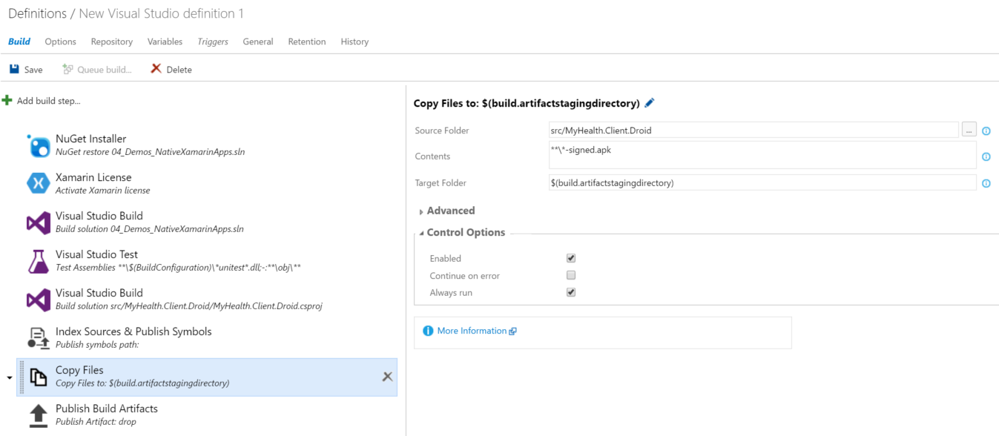

    _Configure Copy Files Task_

    > **Note**: The UWP application is being built as part of the same build. You could also copy the **appxupload** file - the signed app - to the build outputs so that you can release the UWP app from the same build. You will not do so in this workshop.

1. Save the Build Definition. In the toolbar of the build definition, click **Save**. Enter the name `Xamarin CI` and click **OK**.

    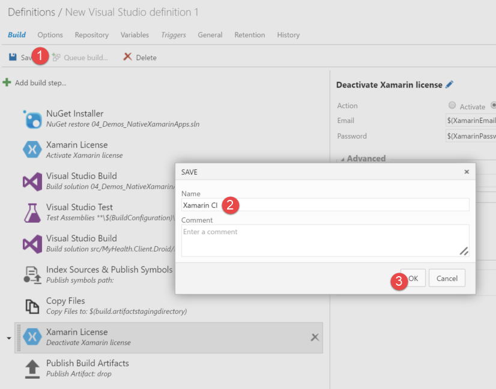

    _Save the Build Definition_

<a name="Exercise2" ></a>
### Exercise 2: Queueing the Build and Fix the Bug ###

In this exercise, you will manually queue the build and analyze the build report. The build will fail, and you will log a bug to fix the problem. You will then
fix the bug and push the fix to the VSTS repo - this will automatically trigger the CI build.

<a name="Ex2Task1"></a>
#### Task 1 - Queueing the Build and Analyzing the Build Report ####

In this task, you will queue a build, and once complete, examine the build report and log a bug for the failing test.

1. Even though this build will be triggered whenever commits are pushed to the master branch on the repo, you can still manually queue a build at any time. In the toolbar of the build definition, click **Queue build...** and then click **OK**.

    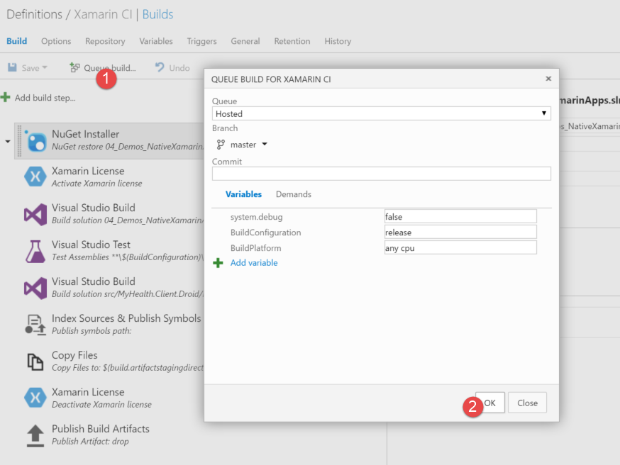

    _Manually queue the build_

1. Once you have queued the build, you will see the log. This is a real-time log from the hosted agent as it runs the tasks you specified in the build definition.

    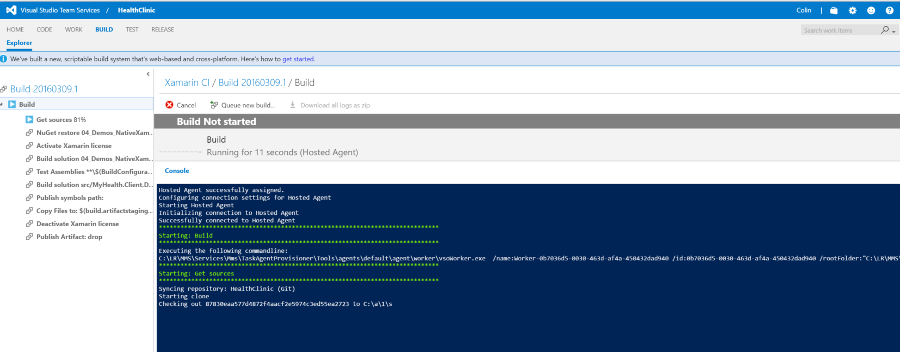

    _The build log_

1. After about 3 minutes, the build should fail. Looking at the tasks in the left of the log will show you that the **Test Assemblies...** task failed. In Module 1, you have seen that one of the unit tests was failing - the test is failing in the build as well.

1. In the toolbar, click the build number (this will be of the format `Build yyyymmdd.1`). This is the build number that VSTS assigned to the build when it was queued.

    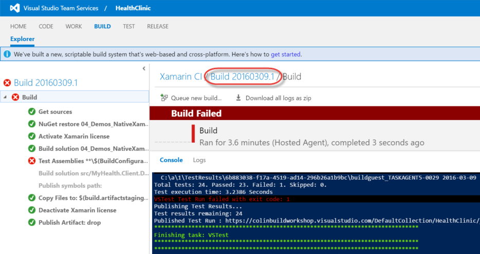

    _Click on the build number_

1. This will open the build report.

    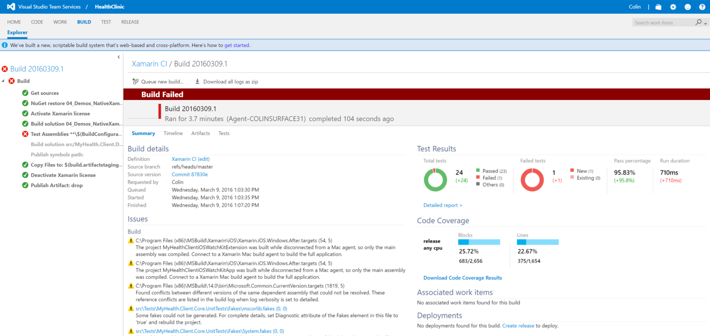

    _The build report for the failed build_

1. In the graphs on the right, you will see that there is a test failure. You will also see trends showing the difference in failures, pass rate and run duration between this build and previous builds (not too useful at the moment since this is the first build).

1. Analyzing the Test Failure. To get more detail about the test failure, click the **Tests** tab at the top of the report.

    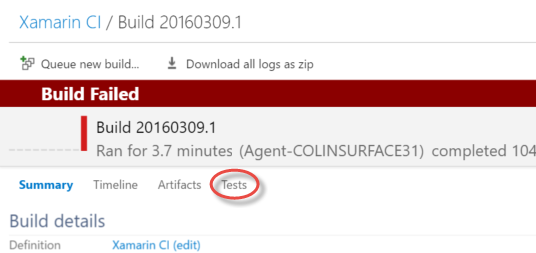

    _Open the Test Results page_

1. In the test list, click the failed test. On the right, you will see the Error message (i.e. _Assert.IsNotNull failed_) as well as the full stack trace.

1. Logging a bug. Logging a bug to track the fix is optional - but can be useful if you're going to defer the bug fix. It is best practice to fix CI build failures as soon as possible, since a failing CI build is signaling that there is a quality issue in the code.

1. Click the **Create bug** button in the toolbar above the test outcome list.

    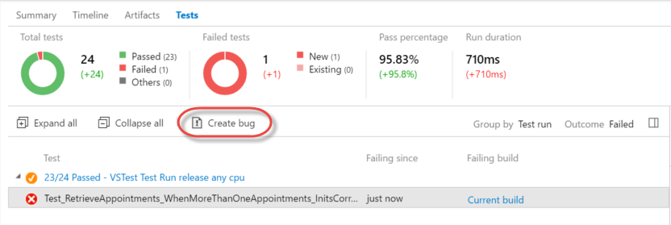

    _Create a bug for the test failure_

1. Take a moment to view the information that VSTS automatically fills in on the Bug form. The **Repro Steps** field contains the name of the test, the name of the machine on which the test was running, the build that the test was running in, the error message and the stack trace. This is a rich bug - and it required a single button click to create!

    > **Note**: The stack trace shows the line that the `Assert.IsNotNull failed` on (83) of HomeViewModelTests.cs. Make a note of this for the next exercise.

1. You can change any of the fields if you need to - for now, just click **Unassingned** at the top of the form and assign the bug to yourself. Click the **Save** button in the toolbar on the upper right.

    

    _Assign the bug to yourself_

1. Once the Bug is saved, it will obtain an ID from VSTS. Make a note of the ID in the upper left of the form.

    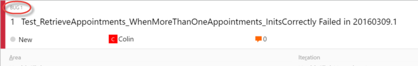

    _Note the Bug ID_

1. Close the form.

<a name="Ex2Task2"></a>
#### Task 2 - Fixing the Bug in Visual Studio ####

In this task, you will open the failing test in Visual Studio and fix the bug.

1. Open Visual Studio and open the **04_Demos_NativeXamarinApps.sln** solution if it not already open.

1. If the Test Window is not open, then click **Test->Windows->Test Explorer**. If the test list is empty, then build the solution to discover the tests.

1. In the Test Window, double-click the **Test_RetrieveAppointments_WhenMoreThanOneAppointments_InitsCorrectly** to open it.

1. In the previous exercise, the stack trace of the failing test showed you that the `Assert.IsNotNull` on line 83 of HomeViewModelTests.cs failed. Go to line 83 by pressing **Ctrl+G**, entering **83** and pressing enter. This takes you to the following failing assertion.

    ```csharp
    Assert.IsNotNull(homeviewModel.Appointments);
    ```

    For some reason, when the test gets to this point, the **Appointments** property is null.

1. In the **act** section of the test, the method that is being exercised by this test is called - **HomeViewModel.RetrieveAppointmentsAsync**. Click on the method and then press **F12** to navigate to this method.

1. Fixing the bug. You will immediately see that there is a line of code that has been commented out. Some developer may have been testing locally and commented out the code and committed the change by mistake. Whatever the cause of the bug, the fix is simple: just uncomment the assignment to **Appointments** so that the code looks like the following.

    ```csharp
    internal async Task RetrieveAppointmentsAsync ()
    {
        var appointments = await _myHealthClient.AppointmentsService.GetPatientAppointmentsAsync (AppSettings.DefaultPatientId, AmountOfAppointments);
        if (appointments.Count > 0)
            FirstAppointment = appointments.First ();
        if (appointments.Count >= 2)
        {
            SecondAppointment = appointments.ElementAt(1);
            Appointments = new ObservableCollection<Appointment>(appointments.Skip(2));
        }
    }
    ```

1. Running the test to ensure the fix is valid. In the Test Explorer window, right-click the **Test_RetrieveAppointments_WhenMoreThanOneAppointments_InitsCorrectly** test and select **Run selected tests**. The test should now pass. To make sure that the fix did not break any other code, run all the tests in the **MyHealth.Client.Core.UnitTests** project (you may have to group by project if you have not already done so using the toolbar button at the top of the Test Explorer window).

    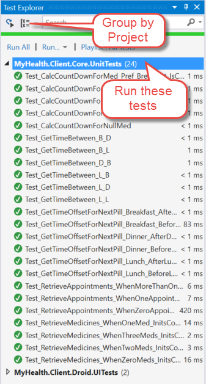

    _Run all the tests_

1. Committing and pushing the bug fix. Now that you have verified that your bug fix works, go to the **Team Explorer** window and navigate to the **Changes** pane. Enter the message `Fixing Appointments assignment - bug #1` into the message box. (If your bug was not ID 1, then use whatever ID your bug had in the previous exercise). This associates this commit to work item with id **#1** - in this case, the bug.

    > **Note**: The association is only made by VSTS one the commit has been pushed to the server.

1. In the **Changes** pane, pull down the menu of the **Commit** button and press **Commit and Push**.

    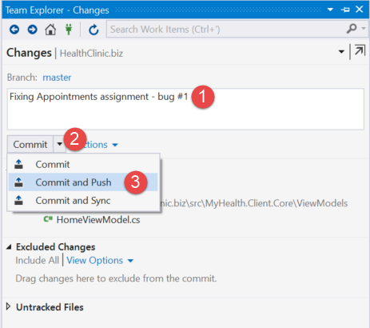

    _Commit and push the bug fix_

1. Viewing the triggered build. Once the commit has been pushed, you can open the browser to the **BUILD** hub of your team project again. Click the **Xamarin CI** node in the list of builds and then click the **Queued** tab.

    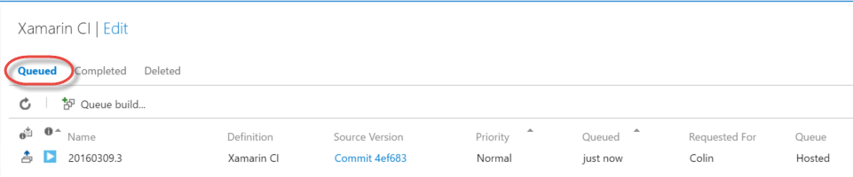

    _Viewing queued builds_

1. The icon on the very left of the build shows that this is a CI triggered build (it is empty when a build is queued manually). Double click the build to open the log.

1. Once the build has completed, click on the build number to view the build report.

    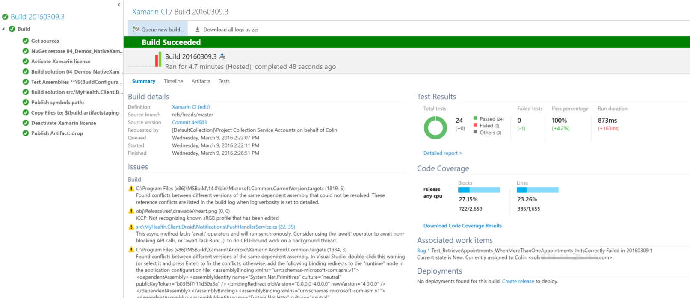

    _Successful build_

1. In the **Test Results** section, you will see that all 24 tests are passing. The build has 1 less failure than the previous build and the pass percentage is up by 4.2%. Under **Associated work items** you should see that the bug is associated with this build - this is because the bug is associated with a commit that is included in this build. Click the **Bug #** link to open the bug. In the **Development** section, you will see the commit has been associated with the bug.

    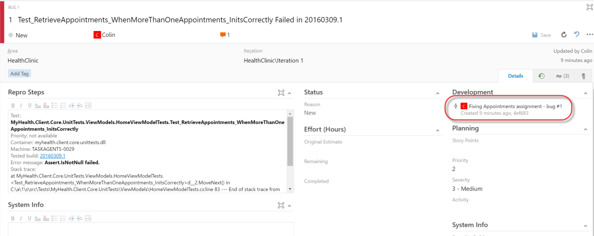

    _The commits associated to this work item_

1. Clicking on the commit will open it in the **CODE** hub.

    

    _The commit details in VSTS_

1. Viewing branch policies. For this workshop, you simply fixed the bug on the **master** branch. A more typical workflow is as follows:

    - A lead developer prevents direct pushes to **master**.
    - A team member that wants to make changes creates a local branch off **master** and makes changes in the branch.
    - When ready, the team member publishes the branch to the repo in VSTS and initiates a **Pull Request**.
    - The Pull Request checks if there will be any merge conflicts when merging back into **master**.
    - The Pull Request can be configured to queue a build to ensure that the build succeeds before merging.
    - Reviewers review the code changes and can comment on the code.
    - The team member can make updates to the code in response to the comments, pushing the changes to the branch.
    - One reviewers have signed off on the changes, the reviewers can initiate the merge on the server.

1. To see how to configure this workflow, navigate to the **CODE** hub and click the **HealthClinic** repo in the menu. Click **Manage repositories...**.

    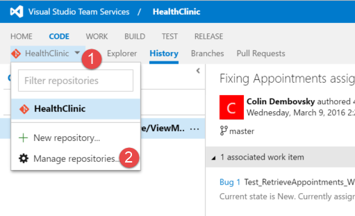

    _Manage the repository_

1. Expand the **HealthClinic** repo node in the left menu and click the **master** branch. Then click **Branch Policies** in the menu.

    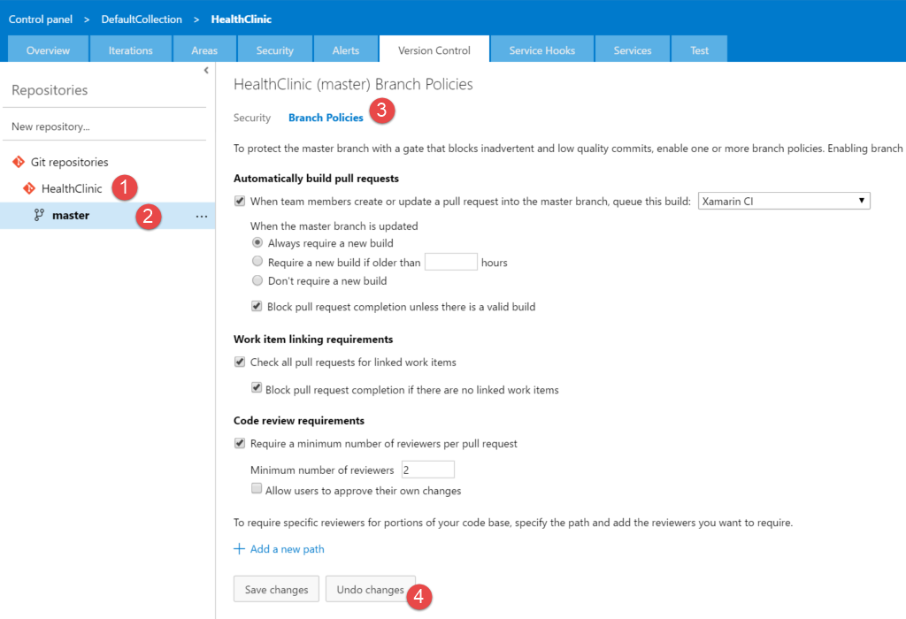

    _Branch Policies_

1. Take a look at the various options, but make sure that you click **Undo changes** before exiting the page.

    > **Note**: In the example image, the `Xamarin CI` build will be queued every time a pull request into `master` is initiated. The Pull Request will be blocked unless there is a valid build. The policy also requires that work items be associated with the commits and blocks if there are none. Finally, the policy enforces that at least 2 reviewers must approve the Pull Request before it can be merged.

 1. Viewing the Build Artifacts. Go back to the **BUILD** hub. At the top of the build report for the CI build, click the **Artifacts** link.

    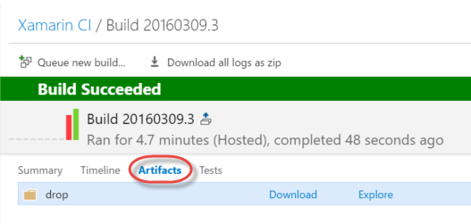

    _View the artifacts_

    This build is configured to produce a single artifact called **drop** (via the **Publish Build Artifacts** task in the build definition).

    > **Note**: Builds can have multiple artifacts - in fact, there will be one for every **Publish Build Artifacts** task in the build definition.

1. Click the **Explore** link on the **drop** artifact. Expand the folders until you can see the signed **apk** file.

    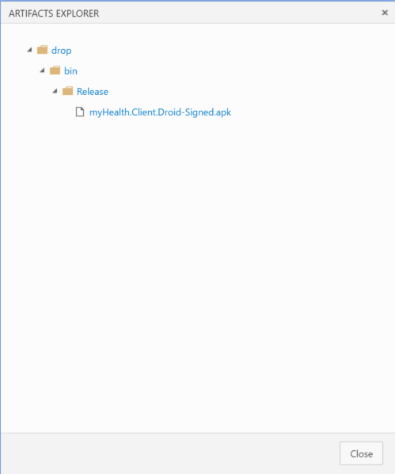

    _The Artifacts Explorer_

    > **Note**: In Module 3, you will see how to release this **apk** file to users through a Release Management pipeline.

1. Close the Artifacts Explorer.

<a name="Exercise3" ></a>
### Exercise 3: Improving Package Versioning ###

In this exercise, you will improve the versioning of the Android package by installing a custom build task from the VSTS Marketplace.

<a name="Ex3Task1"></a>
#### Task 1 - Examine the Android Manifest file  ####

Currently the build produces an **apk** file that has the version code **1.0** for every build. When releasing packages, it is best practice to version the package to match the build number so that you can track which build produced which package. In Module 3, you will learn how to release the package (the **apk** file) that the CI build produces using Release Management. It will be important to have unique version codes for audit purposes during the release pipeline. For now, you will simply configure the build to make the version code of the **apk** match the build number in VSTS.

In this task, you will examine the **AndroidManifest.xml** file to see where the **apk** version is defined.

1. Open Visual Studio and open the **04_Demos_NativeXamarinApps.sln** solution if it not already open.

1. In the Solution Explorer, expand the **MyHealth.Client.Droid** project, then expand the **Properties** folder and double click **AndroidManifest.xml** to open it.

    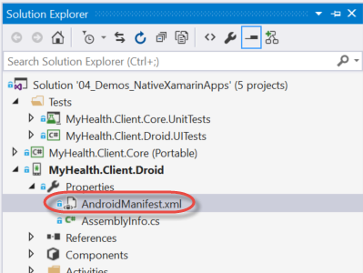

    _Open the Android Manifest file_

1. In the file, you will see an attribute called **android:versionCode** in the **manifest** element. It is currently set to **1**. This version code is the "minor" version code for the **apk** file that is created when calling the **SignAndroidPackage** target on the **MyHealth.Client.Droid** project. This number will have to be matched to the build number during the build.

    > **Note**: The versionName is the "major" version number and should only be updated manually when a major release of your app is to be published.

    Now that you know where to set the version code for the **apk**, you can configure the build to set it during the build.

<a name="Ex3Task2"></a>
#### Task 2 - Installing an Extension from the VSTS Marketplace ####

In this task, you will install a VSTS extension that contains some custom build tasks that will help you set the **android:versionCode** during the build.

> **Note**: You could do this many ways, including writing a PowerShell or bat script. However, it is always a good idea to search the Marketplace to see if someone has created a Task that solves a problem you are facing before you reinvent the wheel.

1. In the browser, open the **HealthClinic** Team Project in your VSTS account. In the upper right corner, click the Basket icon and select **Browse Marketplace**.

    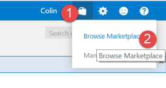

    _Browse to the Marketplace_

1. In the toolbar at the top, click the magnifying glass icon. Enter the term `version assemblies` and press enter. Click the tile **Colin's ALM Corner Build Tasks**.

    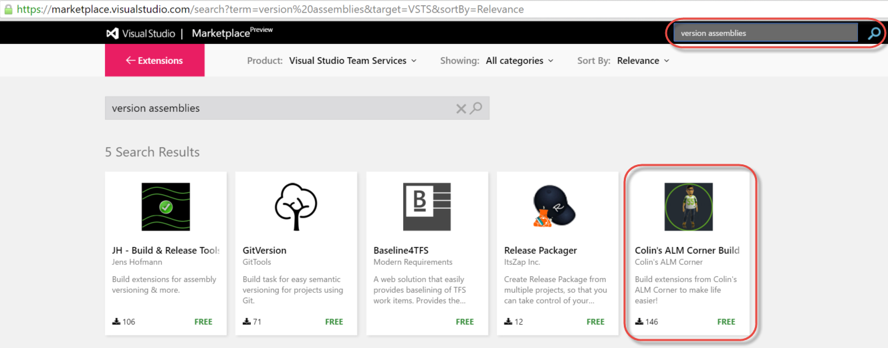

    _Search for Version Assemblies in the Marketplace_

1. This extension contains several build tasks. One of them is **VersionAssemblies** and will allow you to version the **apk** file via the Android manifest file during the build. Click **Install**.

1. In the confirmation window, ensure that the correct VSTS account is selected and click **Continue**. Once permission has been verified, click **Confirm**.

    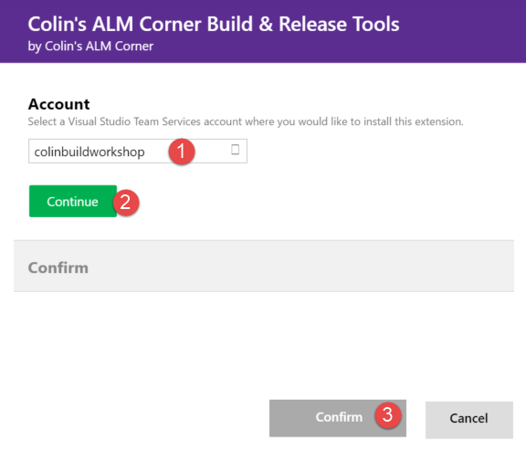

    _Confirm the install_

1. You can close the Marketplace tab once the install is complete.

1. Add Version Assembly Task to the Build Definition. Click **BUILD** to open the build hub. In the left menu, find the **Xamarin CI** build and click it. Then click the **Edit** link in the main view to open the definition.

1. Click **Add build step...** and scroll down in the Build tasks to the **Version Assembly** task. This task was installed when you installed the Marketplace extension. Click the **Add** button to add it to the definition before closing the Add Task dialog.

    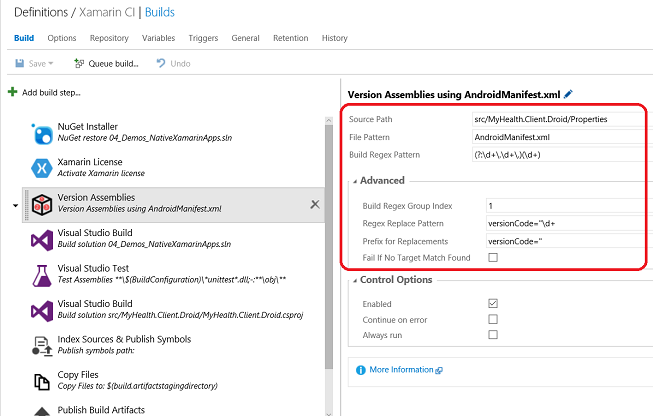

    _Add the Version Assembly task_

1. Drag the **Version Assembly** task so that it is just below the first **Visual Studio Build** task. Expand the **Advanced** group and set the parameters as follows:
    - **Source Path**: `src/MyHealth.Client.Droid/Properties` (you can type this or browse to the folder)
    - **File Pattern**: `AndroidManifest.xml`
    - **Build Regex Pattern**: `(?:\d+\.\d+\.)(\d+)`
    - **Fail If No Match Found**: check this checkbox
    - **Regex Replace Pattern**: `versionCode="\d+`
    - **Prefix for Replacements**: `versionCode="`
    - **Build Regex Index**: `1`

    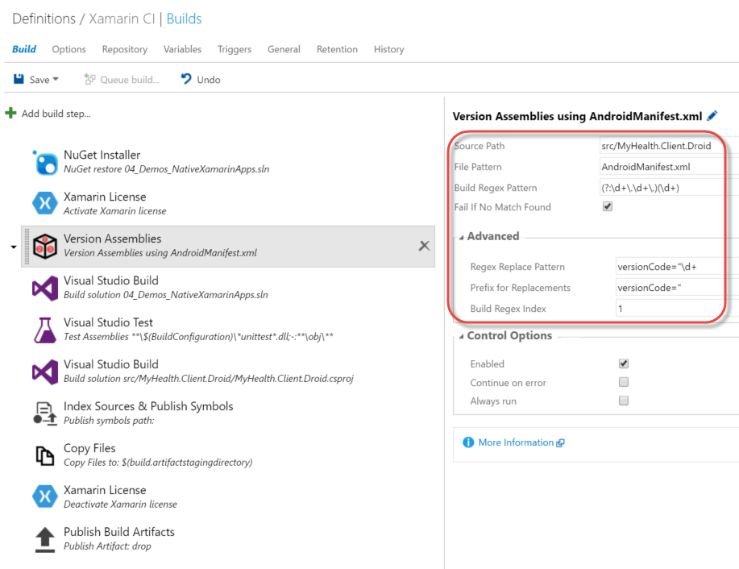

    _Version Assembly task settings_

    Let's examine these parameters:
    - **Source Path**: this is the path in which to find files to replace the version number. In your case, it's the **MyHealth.Client.Droid** project's Properties folder.
    - **File Pattern**: this specifies the file pattern for files in which to replace the version number - you set it to the Android manifest file.
    - **Build Regex Pattern**: This is going to extract the last number of a 3-digit version string. So if the version is **1.0.5**, then this Regex will extract the **5**.
    - **Build Regex Index**: The Build Regex Pattern uses group notation. The 0th group ends up being the entire version number, while the 1st group is the actual number that should be used in the replacement - so you set this to 1.
    - **Fail If No Match Found**: If there is no match for the replacement Regex, then fail this task. This ensures that you know if the version number could not be successfully replaced.
    - **Regex Replace Pattern**: You set this to `versionCode="\d+`. The task will find `versionCode="1` in the target file (note that the ending `"` is not part of the pattern).
    - **Prefix for Replacements**: You set this to `versionCode="` since the replacement pattern will include the string `versionCode="` which we need to prefix to the  version number so that we retain the `versionCode="` string.

1. The **Version Assembly** task assumes that the build number is of the form `1.0.1` - i.e. 3 digits separated by periods. However, the default format (as you will have seen in the builds that have run so far) is `yyyymmdd.r` where `r` is an incrementing integer. Click on the **General** tab. Change the **Build number format** field to `1.0$(rev:.r)`. This will produce the correct format for the version number.

    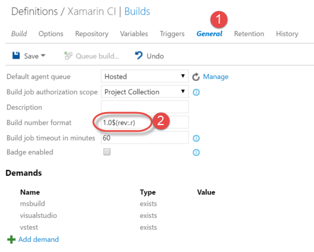

    _Set the Build number format_

1. Save the build. Once it is saved, click **Queue build** to queue a new build. Verify that the build number is `Build 1.0.1` and then immediately cancel the build. Since the Android Manifest is already set to `versionCode="1"`, you want to queue a build where the revision is not a 1. Immediately queue a new build - this time, the build number should be `1.0.2`.

    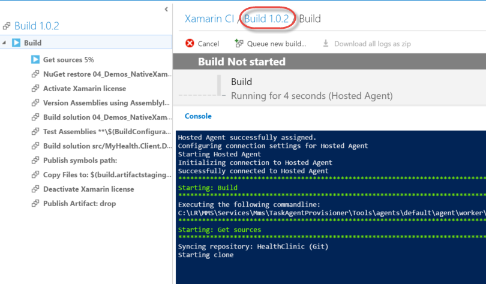

    _The build number_

1. Verify that the **apk** version code is set correctly. Once the build has completed, you can verify that the version code is set correctly. The first check is to look at the build log and make sure that the **Version Assembly** task has run correctly. Click on the **Version Assemblies** node in the task log to see the logs for that task.

    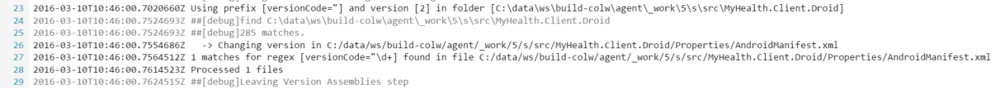

    _The Version Assemblies log_

1. You should see the task has used version 2 and processed 1 file. To really be sure though, you must download the **apk** file. Click **Artifacts** and then click **Explore**. Expand the folders until you find the **myHealth.Client.Droid-Signed.apk** file and click **Download** to download it. Save it to **c:\buildworkshop**.

1. In Visual Studio, open the **Android Adb Command Prompt** from the toolbar.

    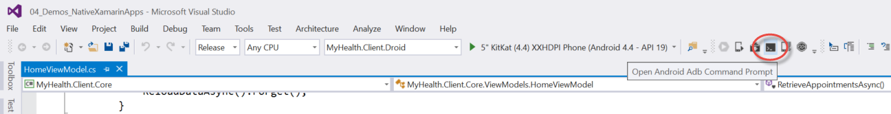

    _The Android Adb Command Prompt button_

1. Enter the following commands.

    ```
    cd \buildworkshop
    "c:\Program Files (x86)\Android\android-sdk\build-tools\19.1.0\aapt.exe" dump badging myHealth.Client.Droid-Signed.apk
    ```

1. This dumps information about the **apk** file - scroll right to the top of the information and you should see that the version code is **2** (since the build is `1.0.2`).

    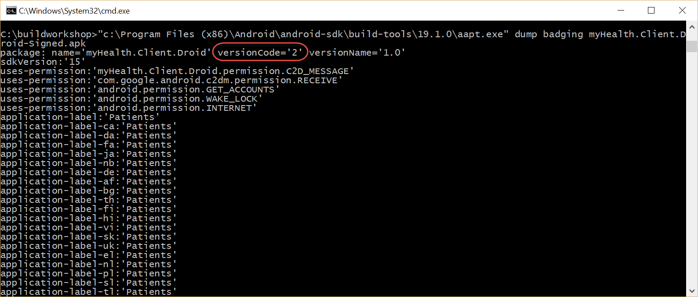

    _The apk version code_

---

<a name="Summary" ></a>
## Summary ##

By completing this module, you should have:

- Created a Team Build with a CI trigger for the Xamarin solution
- Analyzed test results for the build
- Logged a rich bug from test failure
- Triggered a build by committing the bug fix to the repo
- Improved the package versioning via a custom build task from the Marketplace