<a name="HOLTop" ></a>
# Continuous Delivery for Cross-Platform Mobile Apps using Visual Studio Team Services and HockeyApp #

---

<a name="Overview" ></a>
## Overview ##

Continuous Delivery is the next step to good DevOps after Continuous Integration. Typically, this involves ensuring that the application infrastructure is in a good state and configured correctly and then deploying the application to that infrastructure. However, mobile apps present a challenge - you do not manage the target infrastructure - that is, the mobile devices of the users. Getting packaged apps to users in a controlled and managed manner is not trivial.

In Module 1, you covered developing cross platform mobile apps using Xamarin. You learned about the project structure and Portable Class Libraries and saw how to unit test the core of the application. You then created a Visual Studio Team Services (VSTS) Team Project and committed the code into it.

In Module 2, you covered how to create a Continuous Integration Build in VSTS that queues a build to compile, test and package code for deployment every time
a developer pushes code to the VSTS repo.

In this module, you will learn how to create a Release to automatically release a new version of the app to users. To do this you will release the Android app through [HockeyApp](http://hockeyapp.net/) and Release Management in VSTS. HockeyApp is a service that allows you to manage releases of your apps, gather feedback and diagnose crash reports from your apps.

<a name="Objectives"></a>
### Objectives ###
In this module, you will see how to:

- Create a HockeyApp account 
- Create a VSTS Release Definition with a HockeyApp task
- Queue the Release manually and installed the app via HockeyApp in the emulator
- Track feedback from within the app
- Track app crashes from HockeyApp 

### A Note About HealthClinic.Biz ###
The solution that you will use for this workshop is from [HealthClinic.biz](https://github.com/microsoft/healthclinic.biz). This is a sample repo that Microsoft created. The code has
been modified slightly for this workshop, so if you go to the GitHub repo you may find differences. The mobile apps in the project connect to two services that are hosted in Azure - an
Azure Mobile App and an Azure Web App. The Azure apps have been modified for this workshop so that they are _read only_. Any add, update or delete method will return a successful
response but will not modify any data in the backing database. If you wish to host these services yourself after the workshop, then please refer to the 
[Deployment to Azure](https://github.com/Microsoft/HealthClinic.biz/wiki/Deployment-to-Azure) page in the wiki.

<a name="Prerequisites"></a>
### Prerequisites ###

The following is required to complete this module:

- An email address for creating a new Xamarin account and VSTS account (you will skip this if you have already done Module 1 or Module 2)
- An email address for creating a HockeyApp account (you can use the same email address for all 3 accounts if you want to) 

<a name="Setup" ></a>
### Setup ###

> **Note**: If you have completed Module 1 or Module 2, then you can skip this section and go straight to [Exercise 1](#Exercise1)

#### Sign up for a VSTS Account ####

Before continuing, you must sign up for a free VSTS account.

> **Note**: You can skip this task if you already have a VSTS account. However, you need to ensure that it is an account in which you are the account owner. In other words, if you create the account yourself, you can skip this step and just sign into your account. However, if some else created the account and added you to the account, then you will need to complete this step. Once you have signed into your existing account, then create a new Team Project as specified in [Task 2](#Ex4Task2).

<a name="SetupTask1"></a>
#### Setup Task 1 - Create a New VSTS Account ####

In this setup task, you will create a new VSTS account.

1. Browse to [https://go.microsoft.com/fwlink/?LinkId=307137](https://go.microsoft.com/fwlink/?LinkId=307137). Enter your Microsoft Account credentials.

    

    _Signing into visualstudio.com_

    > **Note**: If you do not have a Microsoft Account, then you will need to create one by clicking **Sign up now**. Once you have created an account, you can sign in using that account.

1. Create a new VSTS account. Enter the following information.

    - Your name
    - Your region
    - The name of your new account
    - Click the **Create Account** button

    

    _Creating a New VSTS Account_

    > **Note**: You can change your email address and region if you want to.    

1. Once the account is created, you will see the VSTS landing page, which will prompt you to create a new Team Project. The setup script will do this for you, so you can just go on to the next task.

<a name="SetupTask2"></a>
#### Setup Task 2 - Generate a Personal Access Token (PAT) ####

In this setup task, you will generate a Personal Access Token (PAT) which is required to run the setup script.

> **Note**: Generating PATs for API calls is best practice - the tokens can be revoked at any time, and can be scoped as required.

1. In the upper right corner of the browser, pull down the menu by clicking your name. Then click **My profile**.

    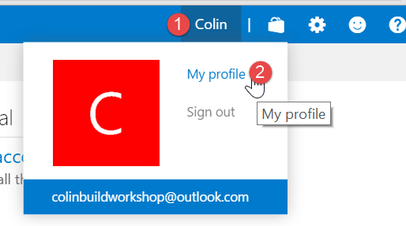

    _Accessing My Profile page_

1. Click the Security menu on the left. In the Personal Access Tokens section, click the **Add** button.

    

    _Click Add in the Personal Access Token section_

1. In the form, enter the name BuildWorkshop. Leave all the defaults and click Create:

    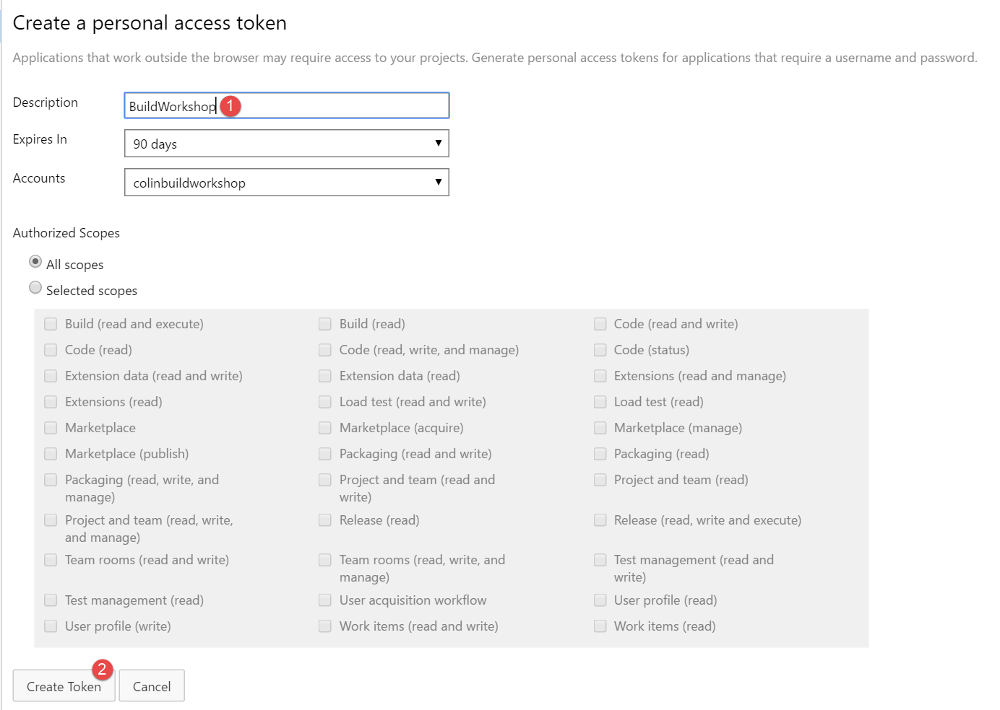

    _Creating a PAT_

1. After the token is created, it will be displayed to you, but only once. Make a note of this access token - if you lose it you will have to create a new one.

    

    _Copying the PAT_
 
<a name="SetupTask3"></a>
#### Setup Task 3 - Create a Xamarin Account ####

In this task, you will create a Xamarin account.

> **Note**: If you have a Xamarin business license you can use it and skip this task.

1. Open a browser to [https://store.xamarin.com/login](https://store.xamarin.com/login "Xamarin Store login"). Click the **Create a new account** link.

	

	_Xamarin Store Login screen_

1. Fill in a name, email address and password. Make a note of the password, since you will need this in a later exercise. Make sure you check both checkboxes and then click the **Register** button.

    

    _Create a new Xamarin account_

	> **Note**: If you get a "validation failed" error, it probably means that your password is not strong enough. Make sure your password is at least 12 characters long.

<a name="SetupTask4"></a>
#### Setup Task 4 - Activate your Xamarin Account in Visual Studio ####

In this setup task, you will activate your Xamarin Account in Visual Studio.

1. Open the Xamarin Account window. To do this, start Visual Studio. In the **Tools** menu, click **Xamarin Account...**.

    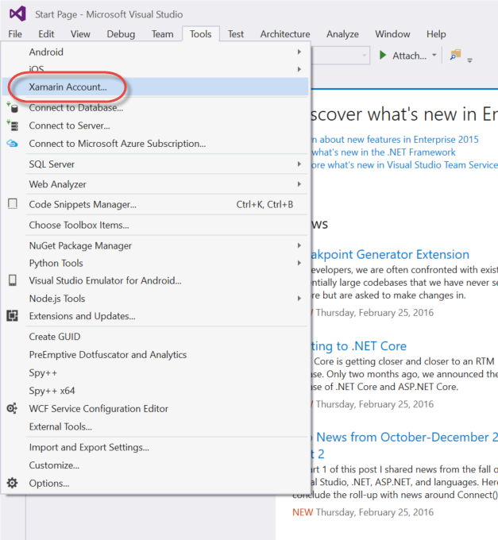

    _Xamarin Account in the Tools Menu_

1. Click the **Log In** button.

    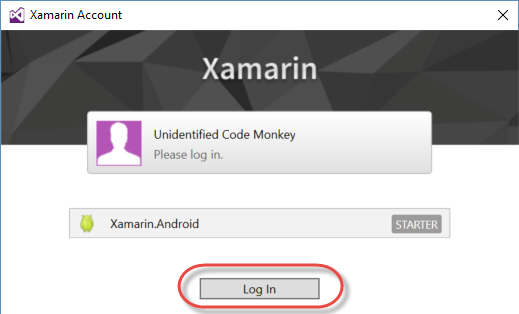

    _Xamarin Login in Visual Studio_  

1. Enter the email address and password that you used for creating your Xamarin account in [Task 1](#Ex1Task1) and press the **Login** button.

    

    _Xamarin Credentials in Visual Studio_  

1. Once activated, you should see your account has been logged in.

    

    _Logged in to Xamarin in Visual Studio_

1. You can close the dialog.

<a name="SetupTask5"></a>
#### Setup Task 5 - Activate a Xamarin Business Trial ####

In this task, you will open the Xamarin solution for cross-mobile apps for HealthClinic.biz and activate your Xamarin Business trial license.

1. In Visual Studio, click **File->Open->Project/Solution**. Browse to **c:\buildworkshop\HealthClinic.biz** and open **04_Demos_NativeXamarinApps.sln**.

1. Once the solution is open, you may be prompted to configure a Xamarin Mac agent. Since we don't have one for the workshop, you can check the **Don't show this again** checkbox and click **OK**.

    

    _The Xamarin Mac Agent Dialog_

    > **Note**: In order to compile Xamarin.iOS projects, you will need a Mac agent running on a Mac machine. Every time you open the solution, you will be prompted to connect to your Mac agent - since you won't have one for this workshop, you can just close the dialog.

1. Click **Build->Build Solution** to build the solution. (You can also use **ctrl-shift-b** or **F6** depending on your Visual Studio Settings). The build should fail. The error message will indicate that the project is too large and requires business or higher license.

    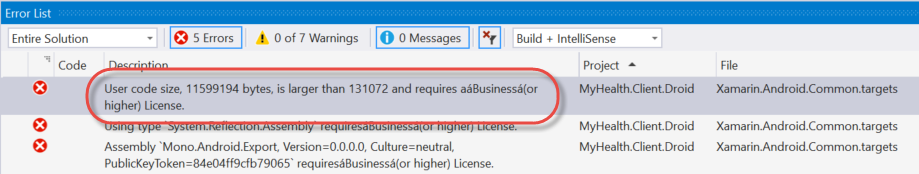

    _Build failure requiring Xamarin Business Edition_

1. **Double click the error**. This will launch the Xamarin license dialog. Click on **Begin a Trial** to begin a trial of the Business edition of Xamarin.

    

    _Select Begin a Trial_

1. Once the trial has been activated, you will see a confirmation dialog.

    

    _Xamarin Business Trail confirmation_
    
<a name="SetupTask6"></a>
#### Setup Task 6 - Run the Setup Script ####

In order to run the exercises in this module, you will need to set up your environment first. **If you have completed Module 1, skip this section**.

1. Open a **Windows PowerShell** command prompt and `cd` to the Modules **Source** folder.

1. Enter the following command:

```powershell
.\Setup.ps1 -vstsUrl https://{youraccount}.visualstudio.com -vstsPat {yourPAT} -xamarinEmail {xamarinEmail} -xamarinPassword {xamarinPassword}
```

where:
- `{youraccount}` is the VSTS account name you created earlier 
- `{yourPAT}` is the VSTS PAT you created earlier.
- `{xamarinEmail}` is the email address for your Xamarin account
- `{xamarinPassword}` is the password for your Xamarin account

> **Note**: For example, the command should look something like:
```powershell
.\Setup.ps1 -vstsUrl https://colbuildworkshop.visualstudio.com -vstsPat pvzgfvhjh5fhsldfh248sl6ifyidfsdisdfs5vbchdsdffksd9hfk3qooh -xamarinEmail myemail@outlook.com -xamarinPassword P@ssw0rd
```

1. Wait until you see a green `Done!` before continuing.

	

	_The Setup script completed successfully_

---

<a name="Exercises" ></a>
## Exercises ##
This module includes the following exercises:

1. [Create a HockeyApp Account](#Exercise1)
1. [Create a VSTS Release Definition](#Exercise2)
1. [Queue the Release](#Exercise3)
1. [Track User Feedback](#Exercise4)
1. [Track App Crashes](#Exercise5)

Estimated time to complete this module: **60 minutes**

> **Note:** When you first start Visual Studio, you must select one of the predefined settings collections. Each predefined collection is designed to match a particular development style and determines window layouts, editor behavior, IntelliSense code snippets, and dialog box options. The procedures in this module describe the actions necessary to accomplish a given task in Visual Studio when using the **General Development Settings** collection. If you choose a different settings collection for your development environment, there may be differences in the steps that you should take into account.

<a name="Exercise1" ></a>
### Exercise 1: Create a HockeyApp Account ###

In this exercise you will create a HockeyApp account. You will use the Android emulator as if it was a real device to see how users will interact with HockeyApp. You will also configure a connection between
HockeyApp and your VSTS account so that you can later log bugs in HockeyApp and see them created in VSTS.

> **Note**: Even though this workshop will focus on releasing an Android app through HockeyApp, the same principles apply for releasing iOS and Windows applications through HockeyApp.

<a name="Ex1Task1"></a>
#### Task 1 - Create a HockeyApp Account ####

In this task you will create a new HockeyApp account.

1. Open a browser and navigate to [http://hockeyapp.net](http://hockeyapp.net). On the upper right, click the **SIGN UP FOR FREE** link.
    
    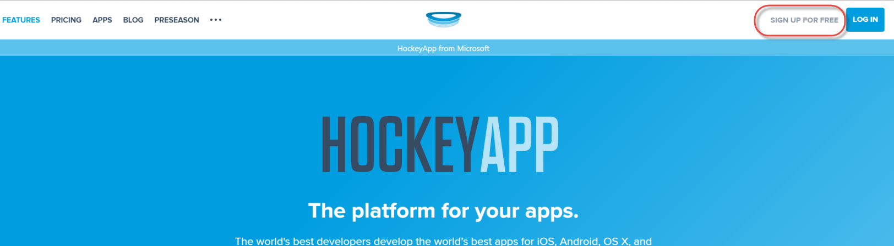
    
    _Sign up for free on HockeyApp_
    
1. Fill in your name, email address and password. Make sure **I'm a developer** is checked. You can fill in your company and opt in to notification via email if you choose to. Click **Register**.
    
    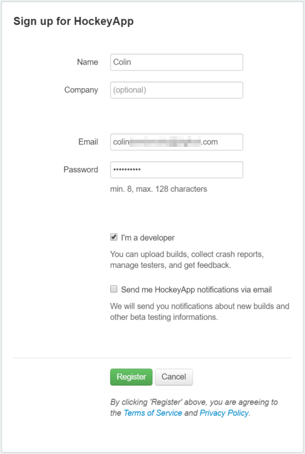
    
    _Register for HockeyApp_
    
1. When the registration is successful, HockeyApp will display a _registration link_. Copy the link down as you will need this in the next exercise.
    
    > **Note**: If you lose the registration link, you can get it by navigating to the dashboard of your HockeyApp account.
    
    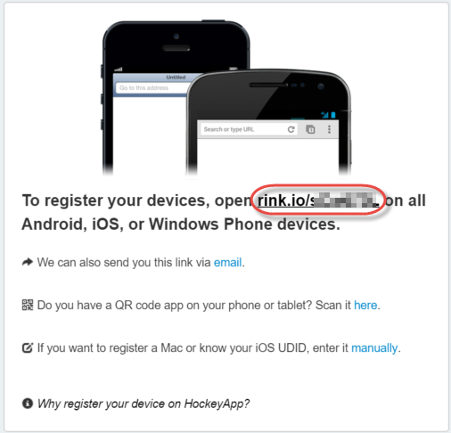
    
    _The HockeyApp registration link_
    
1. You will need to open your email and confirm it before you can continue with HockeyApp. Make sure you do so now.

1. To allow your VSTS releases to authenticate with HockeyApp, you will need a token. Later, you will configure VSTS with the token. In the HockeyApp window, click on your name in the upper right to open your account settings. Then click **API Tokens**. Enter **VSTS** for the name of the token, leaving the **App** and **Rights** settings as defaulted, and click **Create**.
    
    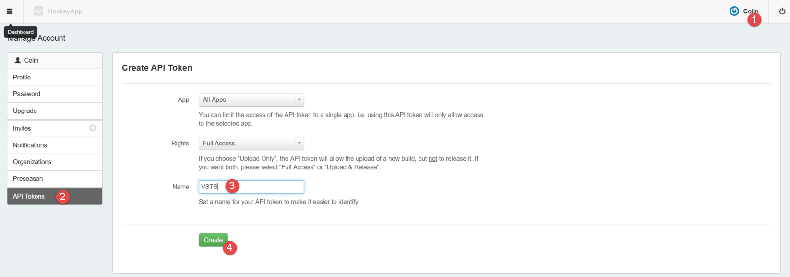
    
    _Create a HockeyApp token_
    
1. Once the token is created, make a note of it. You will need this in the next task.
    
<a name="Ex1Task2"></a>
#### Task 2 - Install the HockeyApp Extension into your VSTS Account ####

In this task you will install the HockeyApp extension into your VSTS account.

1. Install the HockeyApp Extension from the Marketplace. To do this, in a browser, navigate to your VSTS account (e.g. _https://youraccount.visualstudio.com_) where your account is the name you used when you created your VSTS account. Sign in using your account credentials. In the upper right corner, click the Basket icon and select **Browse Marketplace**.
    
    
    
    _Browse to the Marketplace_
    
1. In the upper right, click the search icon (the magnifying glass), enter **HockeyApp** and press enter. Click on the HockeyApp extension.
    
    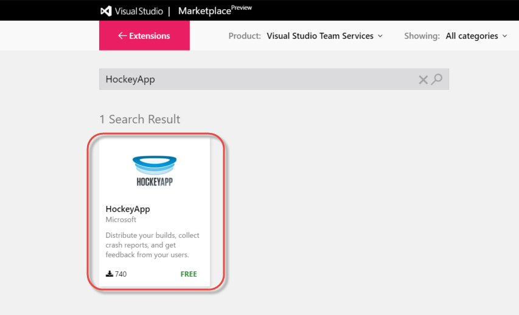
    
    _Click the HockeyApp extension_
    
1. Click the **Install** button to install the extension. 
    
1. Make sure that the account is correct and click **Continue** to validate permissions. Click **Confirm** to install the extension.
    
    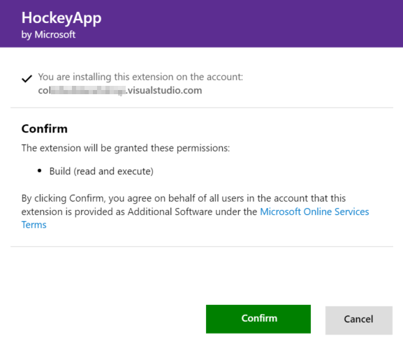
    
    _Install HockeyApp onto your VSTS account_
    
1. Once installed, click the **Close** button.
    
1. In order to push builds to HockeyApp, you will need to authenticate. You have already created a HockeyApp API token in HockeyApp. The HockeyApp extension creates a new connection type to your VSTS account that you can configure with the token. You can then use the connection during releases. Back in your VSTS window, navigate to your **HealthClinic** team project. Then click the **Settings** (gear) icon in the upper right.
    
    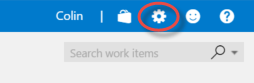
    
    _Click the Settings button_
    
1. Click on the **Services** tab. Then, click on **New Service Endpoint** and select **HockeyApp**.
    
    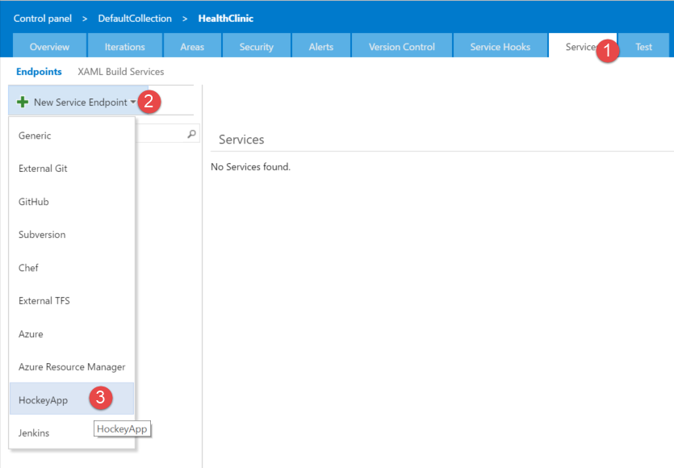
    
    _Create a new HockeyApp connection_
    
1. Enter **HockeyApp** for the **Connection Name** and paste in your HockeyApp API Token. Click **OK**.
    
    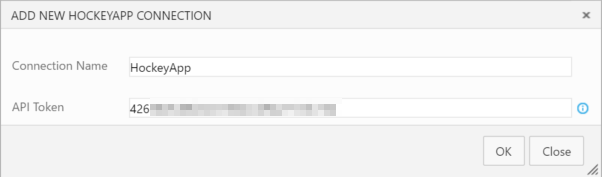
    
    _Create a new HockeyApp connection_
    
1. You will now see a HockeyApp endpoint.
    
    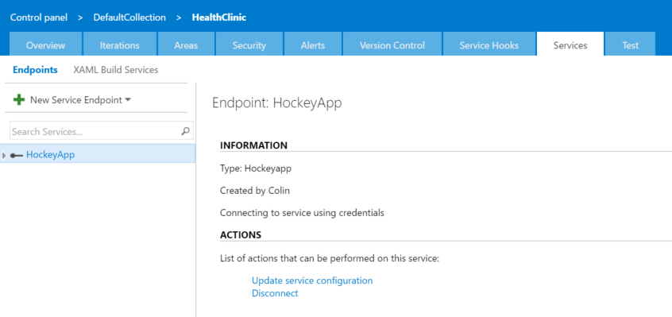
    
    _The HockeyApp endpoint_
    
1. You can now close the settings tab. 

<a name="Ex1Task3"></a>
#### Task 3 - Install HockeyApp in the Emulator ####

In this task you will install HockeyApp on a device for testing the HealthClinic Patients app which is being produced by the CI build. The device you are going to use is the Android
emulator.

1. If the solution is not open in Visual Studio, click **File | Open | Project/Solution**. Browse to **c:\buildworkshop\HealthClinic.biz** and open **04_Demos_NativeXamarinApps.sln**.
    
1. Right-click the **MyHealth.Client.Droid** project and click **Set as Startup Project**. 

1. Start the Android Emulator by running the Android App. In the toolbar, click the run emulator button, which should have a name like **5" KitKat (4.4) XXHDPI Phone (Android 4.4 - API 19)**.
    
    
    
    _Click Run Android Emulator_
    
1. The first time you do so, the emulator is created and configured, so it may take a few moments to start up. Once it starts up, you should see the emulator run the **Patients** app.
    
    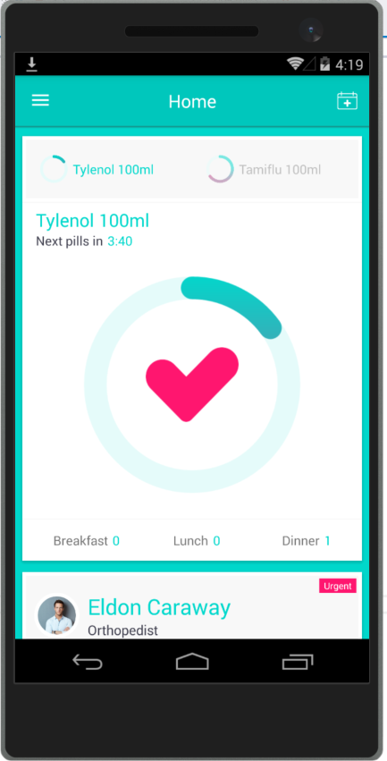
    
    _App in the Android Emulator_
 
1. Press the **Back** button to close the Patients app and go to the main screen of the device.
    
    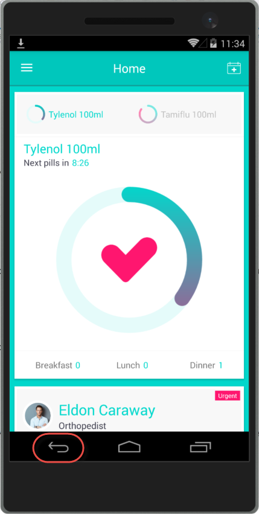
    
    _Press the Back button_
    
1. Click the Browser icon to open a browser.
    
    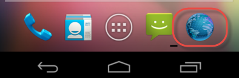
    
    _Click the Browser button_
    
1. Install HockeyApp on the emulator. To do this, enter in the HockeyApp link that you noted earlier into the address bar and press enter. If you do not have this, go the HockeyApp dashboard and obtain the registration link.
    
    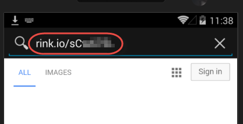
    
    _Enter the HockeyApp registration link_
    
1. The **Register Device** page should show. Click the **Download HockeyApp for Android** button.
    
    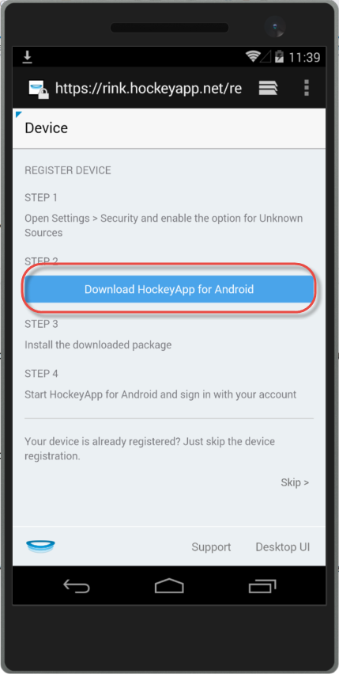
    
    _Download HockeyApp in the Emulator_
    
1. After a few moments, click the **Home** button. Then, click the **Apps** button.
    
    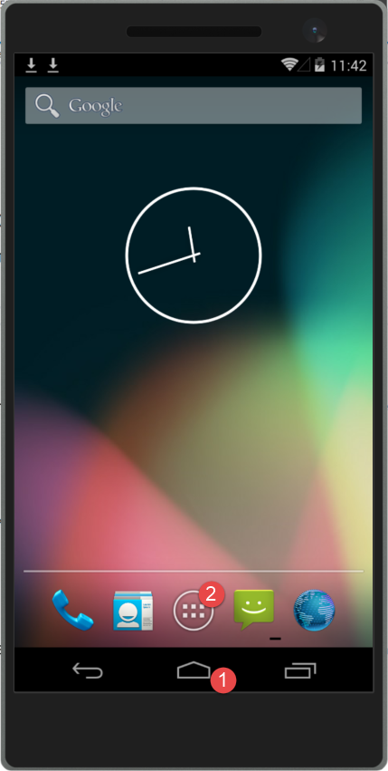
    
    _Click Home and then Apps_
    
1. Click **Downloads** and then click on the **HockeyApp** installer to install it.
    
    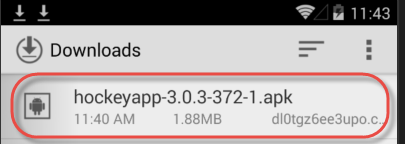
    
    _Click HockeyApp to install it_
    
1. Review the settings, click **Next** and then **Install**.
    
    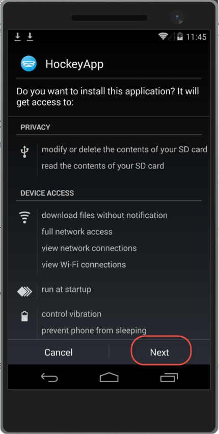
    
    _Install HockeyApp_
    
1. When the install completes, click **Done**.

1. Sign in to your HockeyApp account. To do this, open the HockeyApp by clicking **Home** and then **Apps**. Then, click on **HockeyApp** to open it.
    
    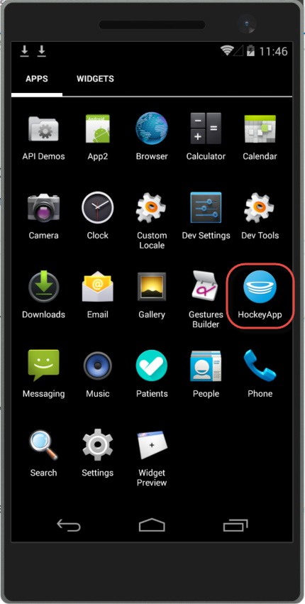
    
    _Start HockeyApp_
    
1. Click on **SIGN IN** to sign in.
    
    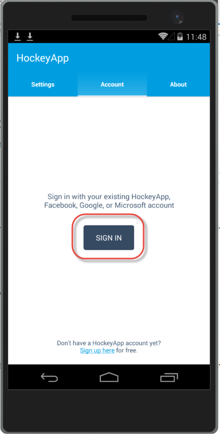
    
    _Click Sign In_
    
1. Enter the HockeyApp credentials you used when creating your HockeyApp account and press **Sign In**.
    
    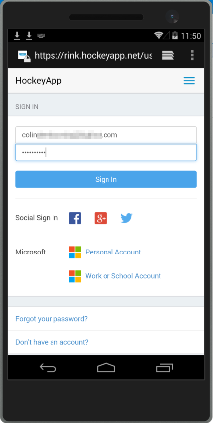
    
    _Enter your HockeyApp credentials_
    
1. Click **Authorize** to authorize the app.
    
    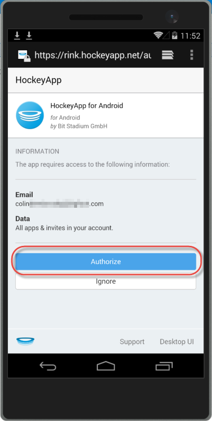
    
    _Authorize HockeyApp_
    
1. You should see the Apps page. At this point, there are no apps registered.
    
    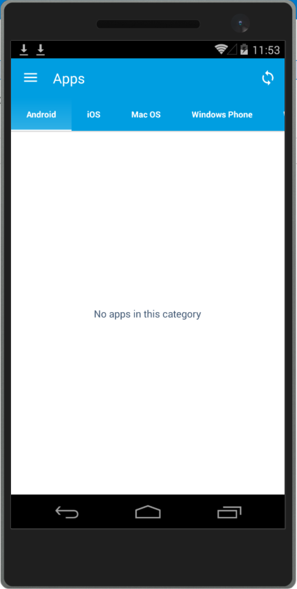
    
    _HockeyApp showing no apps_
    
1. You can now minimize the emulator - if you close it, you will have to start it again using the debugger. Back in Visual Studio, you can stop debugging.
    
<a name="Exercise2" ></a>
### Exercise 2: Create a Release Definition ###

In this exercise you will create a Release definition. The Release defines how packages (in this case the **apk** Android application) moves from _environment_ to _environment_. Each environment is simply a _stage_ in a release pipeline. Typically, these are **Dev**, **Staging** and **Prod** - but they can be anything you want. Each environment specifies a sequence of tasks that is executed in order to install the app into that environment. This could mean creating and configuring servers, copying binaries and even running tests. Furthermore, each environment can require both _incoming_ and / or _outgoing_ approvals.

The Release definition lets you track where in a release pipeline a particular build is, how it moves and is configured, and who approves it at each stage. The release takes one or more _artifacts_ as source packages - in your case, the artifact is the CI build you created in Module 2.

<a name="Ex2Task1"></a>
#### Task 1 - Create a Release Definition ####

In this task you will create a new Release Definition to release the Android application through HockeyApp.

1. Create a new Release Definition. In your VSTS account, browse to your **HealthClinic** Team Project and click **RELEASE** to open the RELEASE hub. Click the green **+** button on the left to create a new Release Definition.
    
    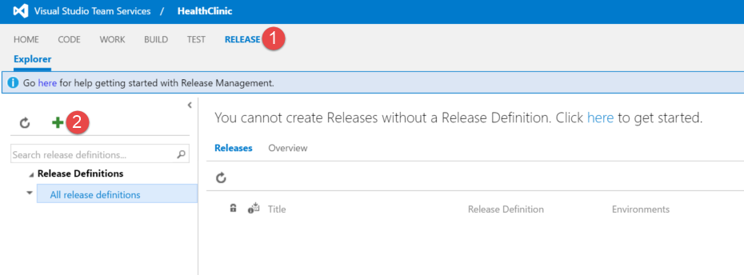
    
    _Create a new Definition_
    
1. Select the **Empty** template and press **OK**.
    
    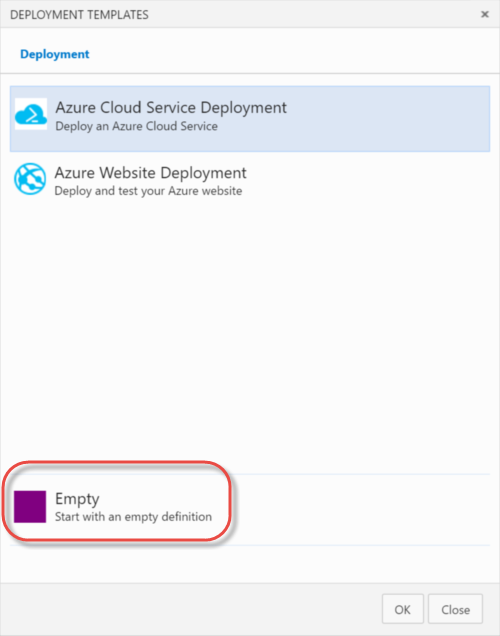
    
    _Select the empty template_
    
1. Enter **Xamarin Android** in the Definition name textbox. 
    
1. Link the CI Build to the Release. Then click **Artifacts**. Click **Link to an artifact source**. The dialog should show **Build** for **Type**, **HealthClinic** for **Project** and **Xamarin CI** for **Source (Build definition)**. Press **Link** to link the CI build to this release.
    
    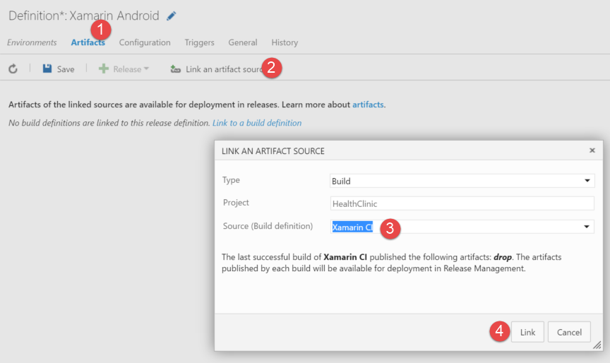
    
    _Link the CI Build to the Release_
    
1. Add a HockeyApp deploy task. To do this, click on **Environments** to go back to the environments.
    
    > **Note**: It is possible to define any number of environments - examples are **Dev**, **UAT** and **Prod**. However, for this workshop you will only have a single environment.
    
1. Click **Add tasks** to add a task to the environment.
    
    > **Note**: If you did Module 2, you will feel comfortable in this screen. VSTS uses the same agent as a build and release agent. Many tasks can be used in both builds and releases. 

1. Under the **Deploy** group, find the **HockeyApp** task and press **Add**. Then, click **Close**.

1. Configure the HockeyApp task. In the **HockeyApp Connection** dropdown, you should see a single connection called `HockeyApp`. 
    
    > **Note**: If you do not see it, then make sure you have completed [Exercise 1 Task 2](#Ex1Task2). You can click the **Manage** link and go to the second step in the task before coming back here.
    
1. Click the **...** button and browse the artifact to the signed **apk** file. Then click **OK**.
    
    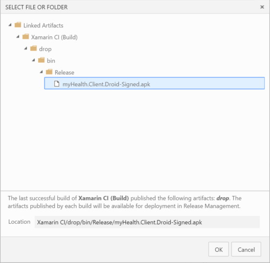
    
    _Select the binary to deploy_
    
1. You can leave all the other fields as they are defaulted. Mouse over the blue information icons next to each field to get help on what the field is for.
    
    > **Note**: It is possible to create Teams in HockeyApp. You could create a small team of beta testers and create a release that only goes to this team (using the **Team(s)** parameter).
    > 
    > When the beta testers have approved the app, you could duplicate the environment, using the same task but this time removing the restriction so that the app is available to all your users.
    
    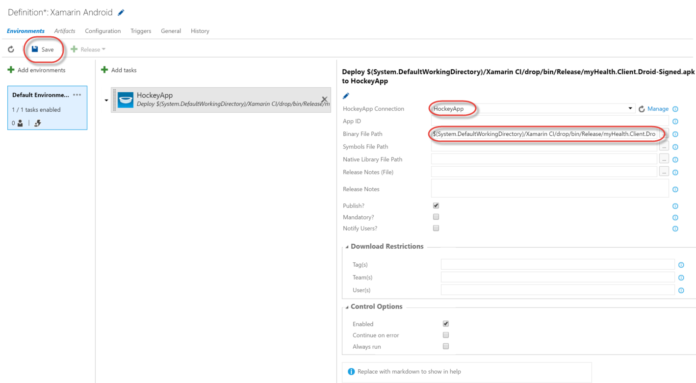
    
    _Save the definition_
    
1. Click **Save** to save the release definition.
    
1. Configure Approvers and Deployment conditions. To do this, click on the **...** button of the **Default Environment** tile and click **Assign Approvers**.

    >**Note**: Before a release can continue, it must obtain approval. There are two types of approval for every environment: _pre-deployment_ and _post-deployment_. Pre-deployment approvals pause the release until the approvers have signaled that the environment is ready to start executing its tasks. Post-deployment approvals pause the release _after_ the tasks have been executed and before proceeding to the next environment (if there is one). Both types of approvals can also be set to automatic.
    
    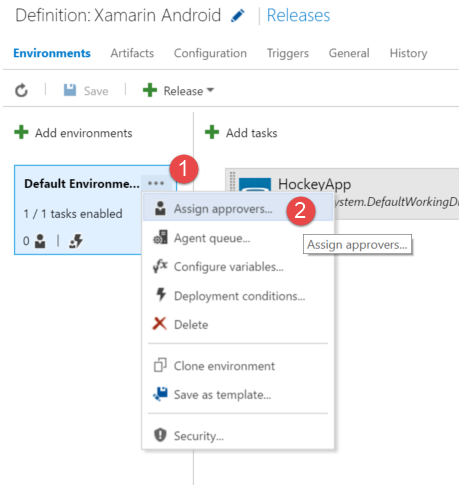
    
    _Click Assign approvers_
    
1. Leave the Pre-deployment approver as automatic. This means that the tasks will start executing immediately when the release reaches this environment.
    
1. Click **Specific Users** on the **Post-deployment approver** and set yourself as the approver. Also check the **Send an email** option to send an email when an approval is pending.
    
    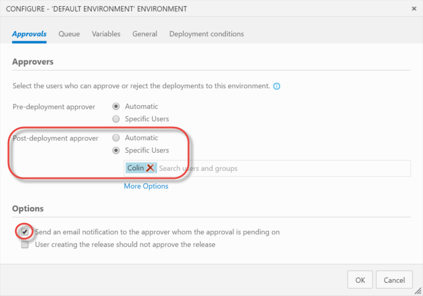
    
    _Configure Approvers_
    
1. Click on the **Deployment conditions** tab. Configure the conditions as follows.
    
    
    
    _Configure the Deployment conditions_
    
1. Click **OK** to close the dialog.
    
1. Configure the Triggers. A CI build is triggered off a push to the source repo. Similarly, the Release can be triggered by an event (e.g. _a new build_). This turns the Release definition into a Continuous Deployment pipeline. Click on **Triggers** to open the triggers page. Click on the **Continuous Deployment** radio and then select the **Xamarin CI** build from the dropdown.
    
    > **Note**: You can also schedule releases at specific times using the `Scheduled` trigger.
    
1. At the bottom of the page you will see the list of environments and their triggers (which you previously defined). In this case, as soon as a new build of the **Xamarin CI** build is ready, a new release will be created. As soon as the release is created, the **Default Environment** will trigger.
    
    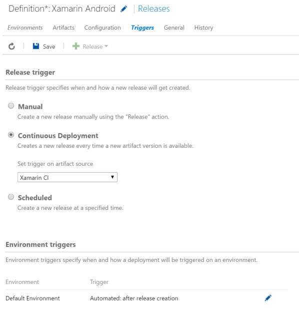
    
    _Configure the Triggers for the Release_
    
1. Click **Save** to save the release.

<a name="Ex2Task3"></a>
#### Task 3 - Trigger the Release Manually ####

In this task you will trigger the release manually to see how the app gets deployed through HockeyApp to the emulator.

1. Create a new Release. To do this, click the **+ Release** button in the toolbar and click **Create Release**. Select the latest build from the **Xamarin CI** build and click **Create**.
    
    
    
    _Create a new Release_
    
1. When the release is created, click the link in the toolbar.
    
    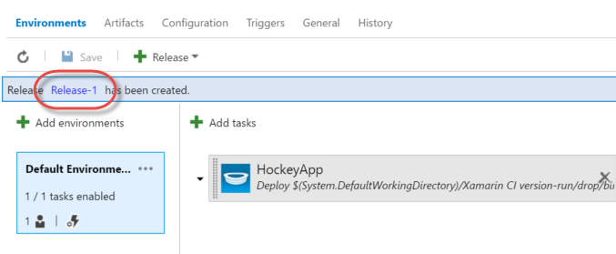
    
    _Click the Release link_

1. You should see the release succeed. At the top of the Summary page, a yellow notification bar is asking for approval.
    
1.  Click on the **Patients** link in the **HockeyApp** section to open the app in HockeyApp.
    
    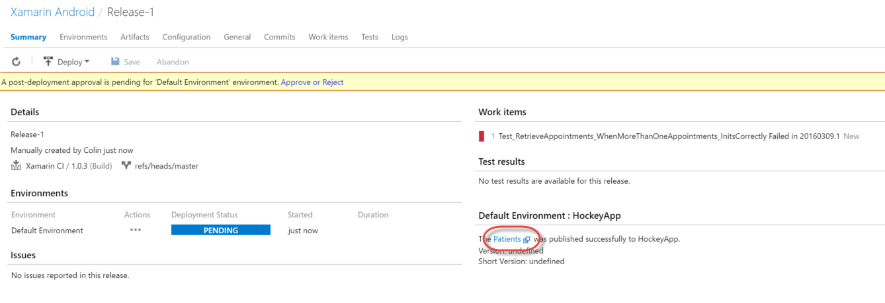
    
    _Click on the Patients link_
    
1. This should open a new tab to the HockeyApp dashboard where you will see the Patients app details.
    
    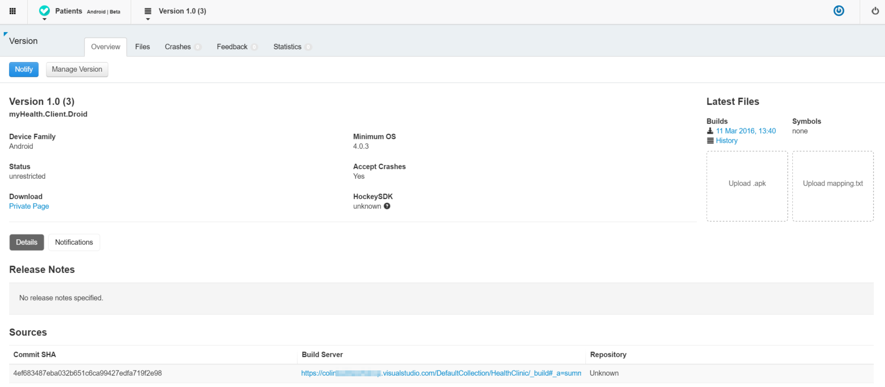
    
    _Patients App in HockeyApp_
    
1. You will have to uninstall the debug version of the app that Visual Studio installed into the emulator when debugging. This is necessary because the key used to sign the app is different in Visual Studio builds than in VSTS builds. In the emulator, click the home icon and then the apps icon. Click **Settings**.
    
    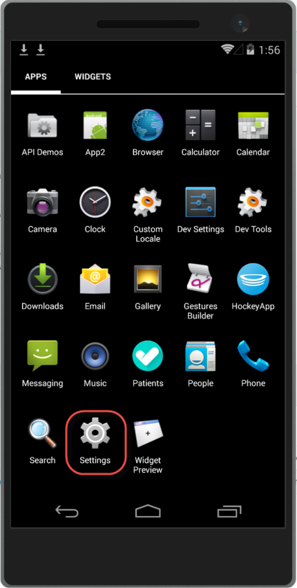
    
    _Click Settings_
    
1. Now click **Apps**.
    
    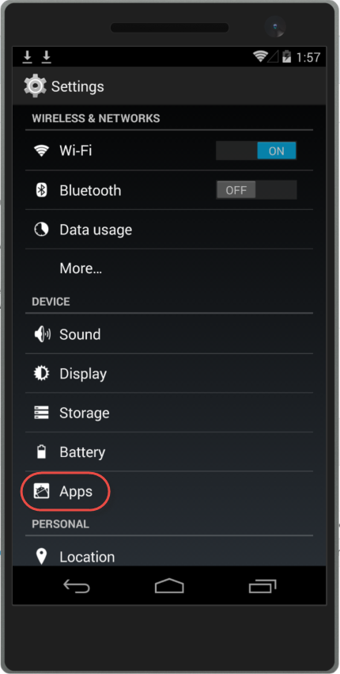
    
    _Click Apps in Settings_
    
1. Scroll down to **Patients** and click it. Click the **Uninstall** button.
    
    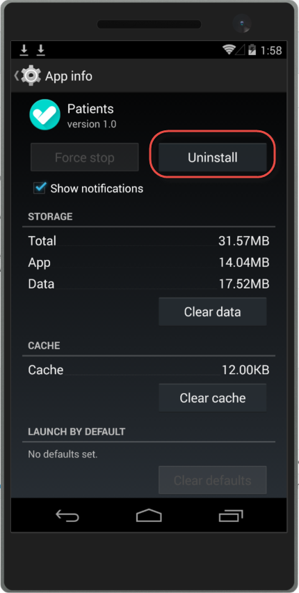
    
    _Uninstall the Patients app_
    
1. Click **OK** when prompted to confirm.
    
1. Install the Patients app in the Emulator via HockeyApp. To do this, launch HockeyApp from the apps center in the emulator.
    
1. If the Apps list is empty, click the refresh button on the top right. You should see the Patients app appear.
    
    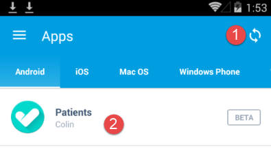
    
    _Click the refresh button in HockeyApp_
    
1. Click the Patients app.
    
    > **Note**: If you had included release notes in the release step, you would see the notes here.
    
1. Click the **INSTALL** button to download and install the app.
    
    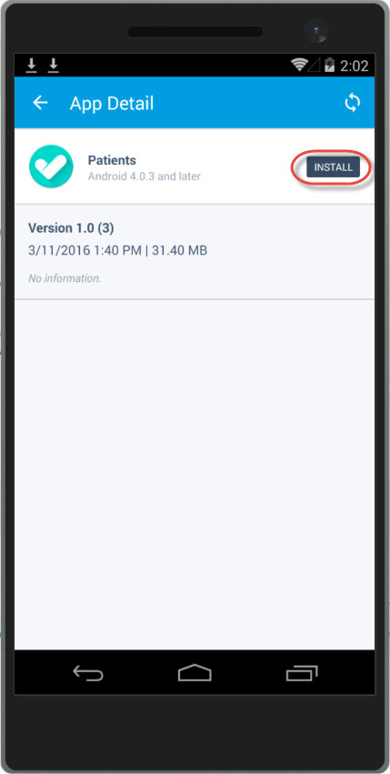
    
    _Install Patients from HockeyApp_
    
1. When the app has been downloaded, click **Install** to install it.
    
    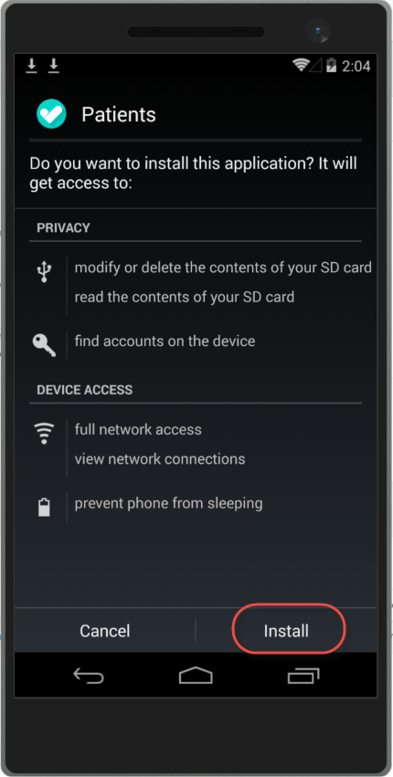
    
    _Click install to install the app_
    
1. When the install completed, click **Open** to run the app. You should see the app start up.
    
    
    
    _Emulator running the Patients app_

<a name="Exercise4"></a>
### Exercise 4 - Track User Feedback ###

In this exercise you will learn how to track user feedback from the app back to HockeyApp. In order to do so, you must set a unique HockeyApp App ID in the app settings of the app. Once you have done this, you will push the change to VSTS, which will trigger the CI build. When complete, the CI build will trigger the Release. After confirming an update to the app, you will log feedback from within the app.

<a name="Ex4Task1"></a>
#### Task 1 - Enter the unique HockeyApp App ID into the code ####

In this task you will obtain the app's unique HockeyApp ID from the HockeyApp dashboard. You will then update the code with this ID and redeploy the app.

1. Get the App ID from HockeyApp, in order to do this, in a browser, open HockeyApp and click the dashboard button (the top left button) to navigate to the dashboard. You should see **Patients** listed under the **Apps** tab. Click the app to open its details.
    
    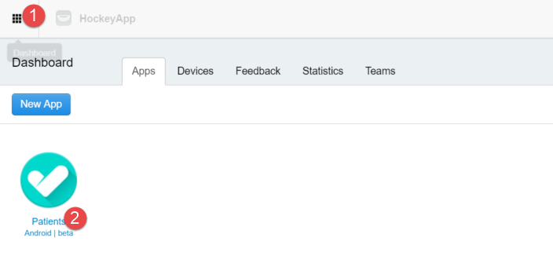
    
    _HockeyApp showing the Patients App_
    
1. In the app details page, copy the **App ID** to the clipboard. This ID uniquely identifies this app within HockeyApp.
    
    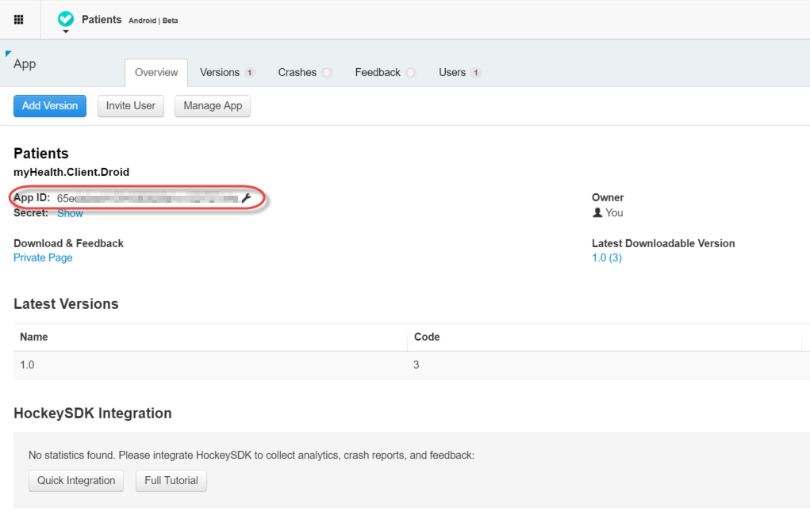
    
    _Get the App ID in HockeyApp_
    
1. Open the **04_Demos_NativeXamarinApps.sln** solution in Visual Studio if it is not already open. In the Solution Explorer, navigate to **MyHealth.Client.Core\AppSettings.cs** and double click it to open it.
    
1. Near the bottom of the file you will see a `static string HockeyAppID`. Set the value of the string to the **App ID** you just obtained from HockeyApp.
    
    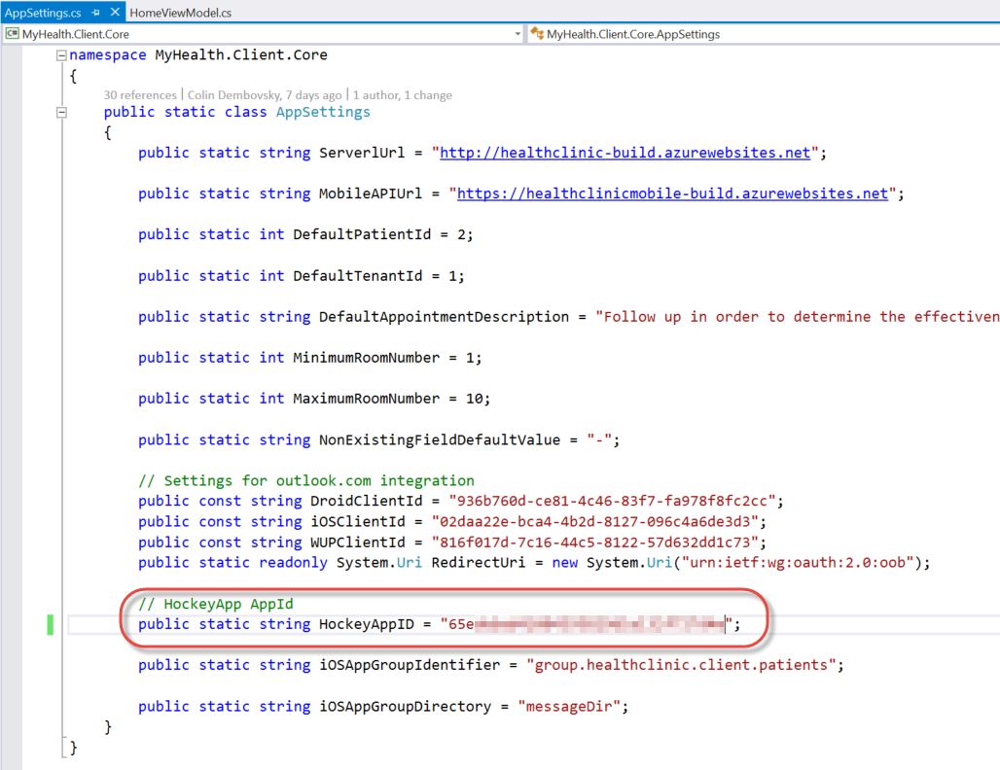
    
    _Set the HockeyApp App ID in AppSettings.cs_
    
1. In **Team Explorer**, navigate to the **Changes** pane and enter **Entering the HockeyApp ID** into the commit message box. Then click the dropdown of the Commit button and select **Commit and Push** to commit and then push your change to VSTS.
    
    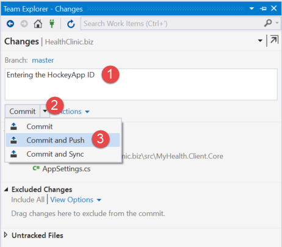
    
    _Commit the HockeyApp ID change_

1. In the **BUILD** hub in VSTS you should see a new build has been automatically triggered by the push.
    
    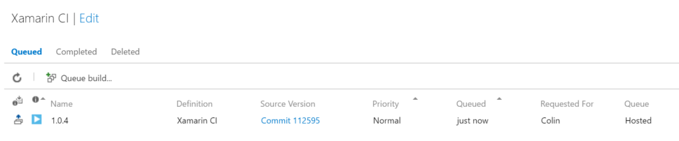
    
    _The CI build triggered by the push_
    
1. As soon as the build completes, verify that a new release should automatically be added to the queue.
    
    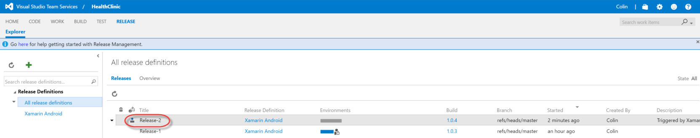
    
    _The CD trigger_
    
1. When configuring the Release, you configured the release to only allow a single release into the pipeline at any time. Since no-one as approved the previous Release, the new release will not start. Click the **Post-deployment approval** icon next to the previous release in the **Environments** column.
    
1. Enter **Release worked fine** and click **Approve**.
    
    
    
    _Approve the previous release_
    
1. As soon as you approve the release, the new release will deploy the new build to HockeyApp. Double click the latest release to open the summary page. Then click on the **Patients** link in the HockeyApp section again. You should see a new version of the App has been created.
    
    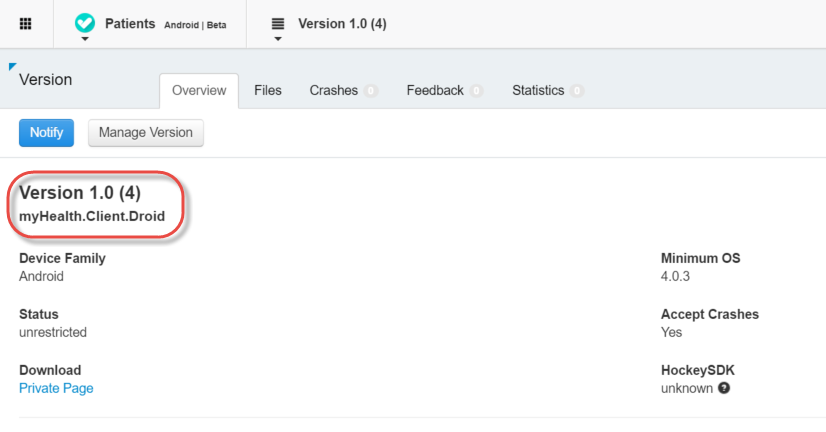
    
    _A new version in HockeyApp_
    
    >**Note**: If you created the build in Module 2, the build definition includes a versioning task that versions the `apk` files incrementally for each build. However,
    if you ran the setup script (you did not do Module 2) then the version number will not increment. You will still see new versions as they become available - the numbers
    will be the same though.
    
1. Install the latest App Manually
    In the emulator, open up HockeyApp. Click the refresh button and click on the `Patients` app. You will see two versions listed: the current one and the new build. 
    
    You will have to uninstall the app manually before installing it from HockeyApp.

1. Install the App Manually
    In the emulator, open up HockeyApp. Click the refresh button and click on the **Patients** app. You will see two versions listed: the current one and the new build. 
    
    > **Note**: Later you will update the app to enable updates from within the app without having to uninstall it first.
    
    Once the app is uninstalled, start HockeyApp. Click on the **Patients** app and click the install button. Confirm the install once the download is complete. Once installed, run the app.
    
<a name="Ex4Task2"></a>
#### Task 2 - Submit Feedback from within the App ####

In this task you will use the HockeyApp feedback form to see how users can provide feedback from an app into HockeyApp.

1. In the upper left menu, click the "hamburger" icon to open the Settings.
    
    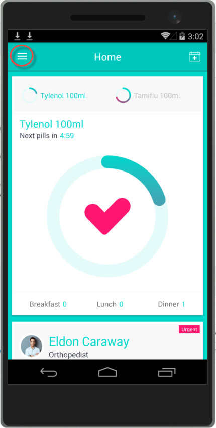
    
    _Click the hamburger icon_
    
1. In the menu, click **Settings**.
    
    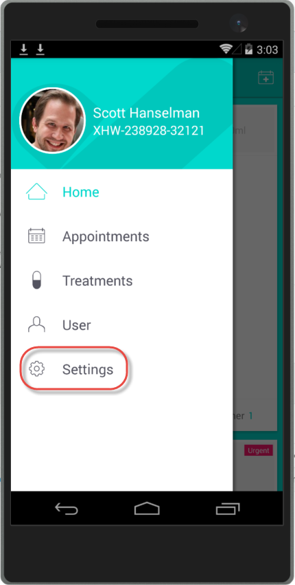
    
    _Click on Settings_
    
1. On the upper right, click **Send Feedback**.
    
    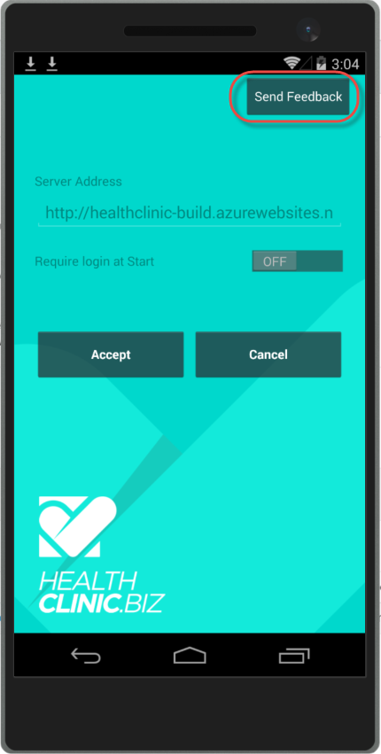
    
    _Click Send Feedback_
    
1. In the Feedback Form, supply a name and email address (if you want to) and then type **Testing feedback** for the subject. Write a note in the **Message** box.
    
    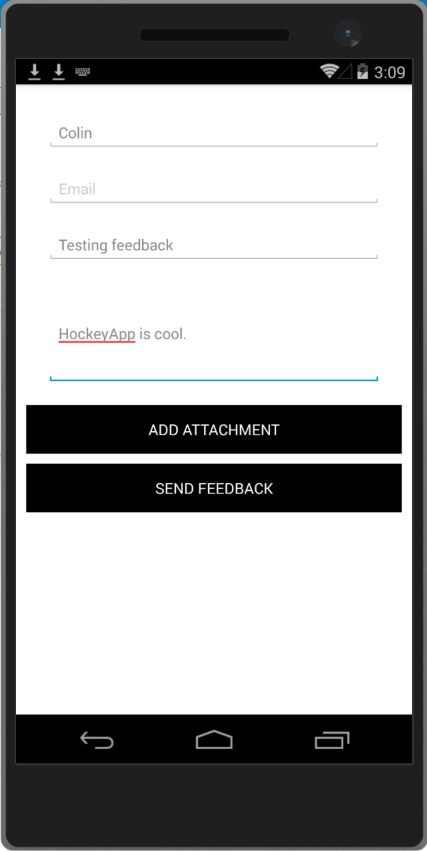
    
    _Providing feedback_
    
    > **Note**: Users can also attach files or images. If they select an image to attach, HockeyApp provides some editing tools that allow users to pixelate sensitive data on the image and annotate the image with arrows and text. If you want to see how this works, then open the camera app and take a picture. Then open this picture as an attachment. You will then see how the annotations work.
    
1. Click **Send Feedback**. When the feedback has been sent, a list of feedback will be shown.
    
    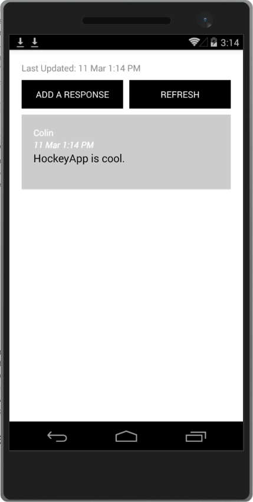
    
    _Feedback sent successfully_
    
1. Open HockeyApp in your browser. Navigate to the **Patients** app to the latest version of the app. Then, click **Feedback** to see the feedback you just logged.
    
    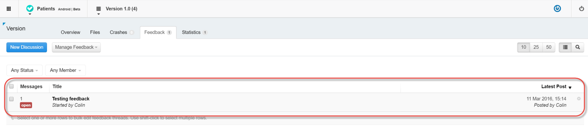
    
    _The feedback in HockeyApp_
    
1. Click the item to open it. In the textbox below, there is a message box that allows you to discuss the feedback with the user. Enter a message and press **Comment**.
    
    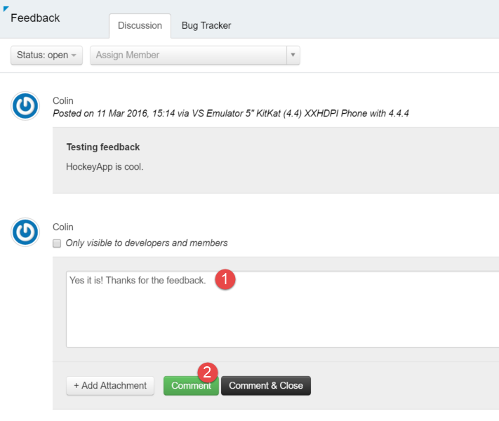
    
    _Entering a comment on a Feedback item_
    
1. Back in the emulator, click the **REFRESH** button to see the comments that you just added in HockeyApp:
    
    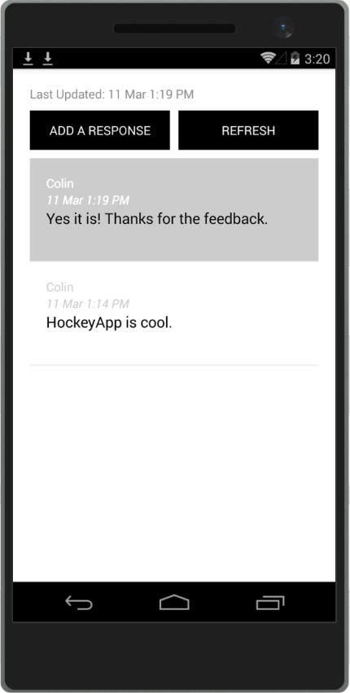
    
    _Feedback discussion in HockeyApp in the emulator_
    
1. Click back to get back to the Settings page of the app.
    
<a name="Exercise5"></a>
### Exercise 5 - Track App Crashes ###

In this exercise you will learn how to track app crashes using HockeyApp. You will enable update and crash tracking and create a new release by pushing the code. Then you will perform an operation that crashes the app and then see the crash information in HockeyApp. You will log a Bug to track the crash and fix it. Pushing the fix will again release a new version. You will then confirm that the crash is fixed.

<a name="Ex5Task1"></a>
#### Task 1 - Enable Update and Crash Management ####

In this task you will enable crash and update management using the HockeyApp SDK.

1. Open the solution in Visual Studio and in the Solution Explorer, navigate to **MyHealth.Client.Droid\Activities\MainActivity.cs**. Find the **RegisterHockeyApp** method and uncomment the first two lines of this method to enable Update and Crash Management.
    
    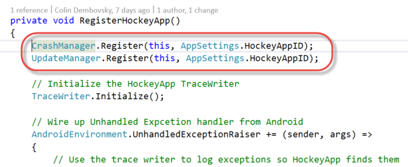
    
    _Enable Update and Crash Management_
    
    > **Note**: The HockeyApp SDK is installed into the project via both a Component and a NuGet package. The **RegisterHockeyApp** method is all that is required to track app crashes and updates within the app.
    
1. In **Team Explorer**, navigate to the **Changes** pane. Enter **Enabling update and crash management** in the message box and click **Commit and Push**. This will trigger a CI build which will in turn trigger a CD release.
    
    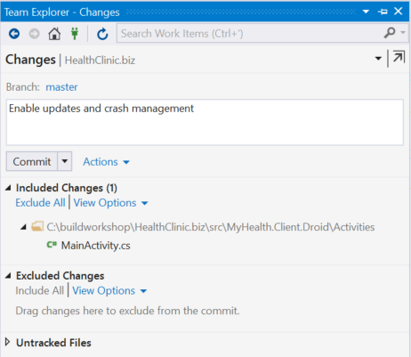
    
    _Commit and Push_
    
1. While you wait for the build and release to complete, approve the previous release. In the **RELEASE** hub in VSTS, approve the latest release so that the new release can begin immediately.
    
    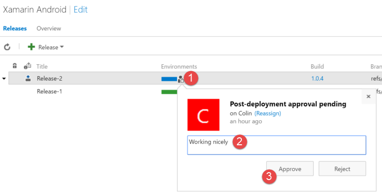
    
    _Approve the latest release_
    
1. You can monitor the latest build by going to the **BUILD** hub and checking the **Queued** builds for the **Xamarin CI** build. Double click to open the log.
    
1. Once the build completes, a new release will be triggered. Wait for the release to complete (to the point where it is paused for post-deployment approval).

<a name="Ex5Task2"></a>
#### Task 2 - Crash the App ####

In this task you will perform an action that crashes the app. You will then look at the crash details in HockeyApp.

1. In the emulator, click the home button and then the apps button. Click on **Settings**, then **Apps**. find the **Patients** app and uninstall it.
    
    > **Note**: This would normally be the last time you have to manually uninstall the app. Now that update management has been enabled, the app will prompt you when a new version is available.
    
1. Now open HockeyApp on the emulator and click on **Patients**. Click install to install the latest build.
    
    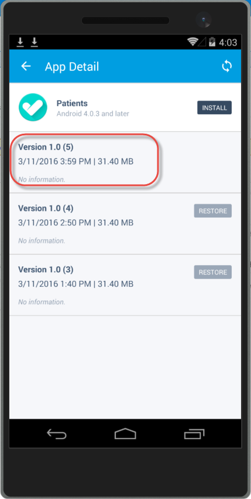
    
    _Install the latest build_
    
1. Once it is installed, open the **Patients** app.

1. In the **Patients** app, scroll down below the medicine reminder to the two appointments. Click on the second (small format) appointment. As soon as you click this appointment, the app should crash.
    
    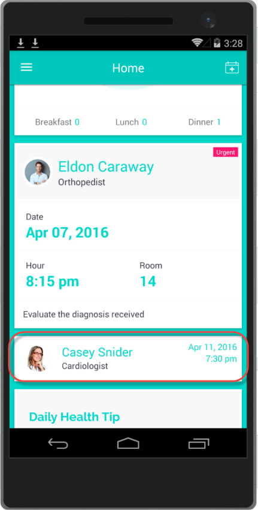
    
    _Click on the second appointment_

1. Log the crash. To do this, click the home button and then the apps icon and start the **Patients** app again.
    
1. The app will now prompt the user to send the app crash report. Click **OK** to send the report.
    
    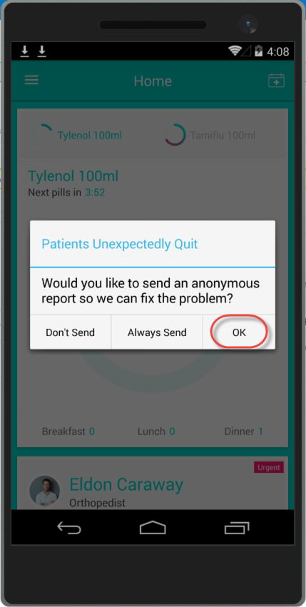
    
    _Send the crash report_
    
1. Go back to HockeyApp and navigate to the latest version of the app. You should see a crash report. Click it to open it.
    
    
    
    _View the crash report_
    
1. The crash report is detailed - showing summary information and details of this particular crash.
    
    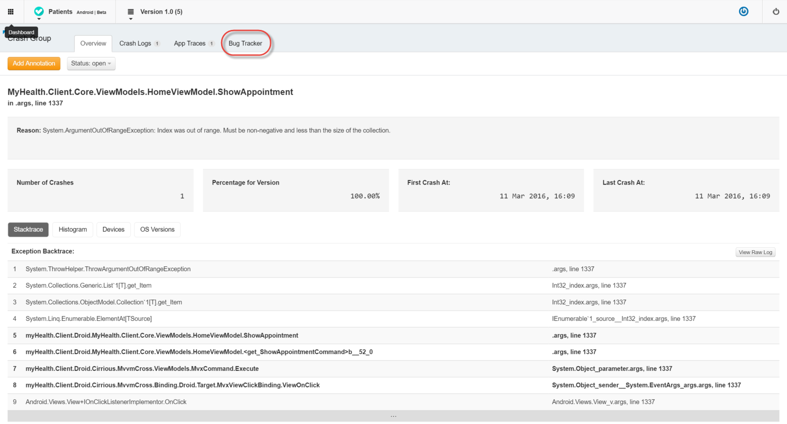
    
    _Crash details_

<a name="Ex5Task3"></a>
#### Task 3 - Configure Bug Tracking to VSTS ####

In this task you will configure Bug Tracking to VSTS from HockeyApp.

1. Once you have looked at the stack trace, the histogram, the crash logs and app traces, click on **Bug Tracker**. Click on the **Configure Tracker** button.
    
    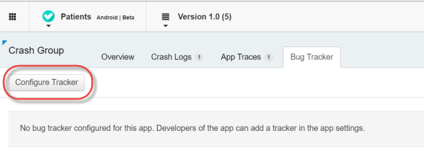
    
    _Click Configure Tracker_
    
1. In the list scroll down to **Visual Studio Team Services** and click **Configure**.
    
    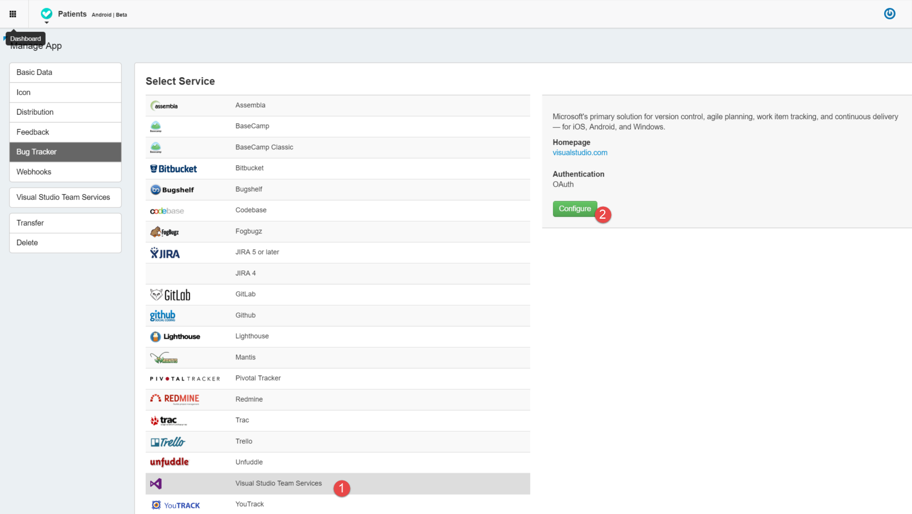
    
    _Select VSTS_
    
1. When the Authorize application page shows, click **Accept** to authorize HockeyApp.
    
1. Once you have accepted, you will be returned to complete the configuration in HockeyApp. Make sure the correct account is selected and then click **Load Projects**.
    
    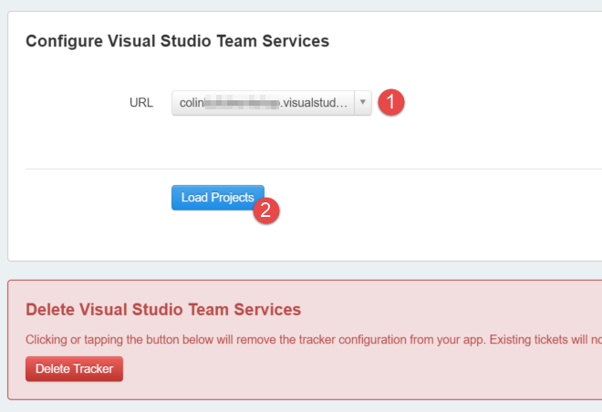
    
    _Load Projects in HockeyApp_
    
1. In the settings, select the **HealthClinic** Team Project. Enable **Auto Create Tickets** and click **Save**.
    
    > **Note**: A crash group is a grouping that HockeyApp makes based on the crash type. If 1000 users have the same crash, there will only be a single crash group in HockeyApp.
    
    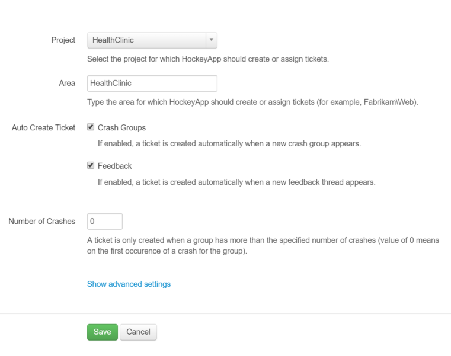
    
    _Complete the VSTS configuration_

1.  Click **Patients** in the toolbar to return to the Patients app. Click on **Crashes** to open the app crash from earlier. Click on the crash and then click **Bug Tracker** to create a new ticket.
    
1. Review the Ticket details and then click **Save** to create a VSTS work item.
    
    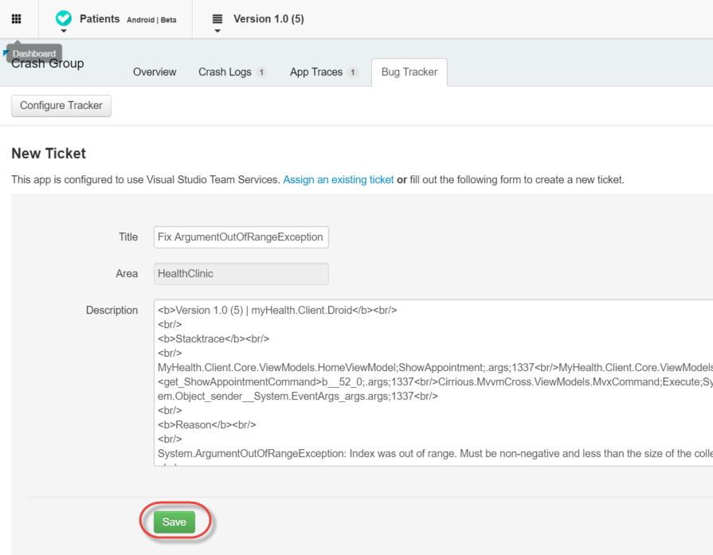
    
    _New Ticket in HockeyApp_
    
1. Click the **View** button to open the Bug in VSTS.
    
    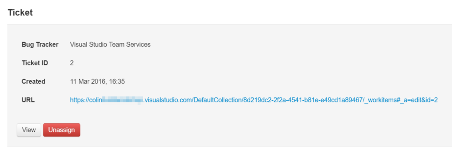
    
    _View the ticket in VSTS_
    
1. You will see the detail in **Repro Steps**. Scroll down to see the link back to the HockeyApp Ticket.
    
    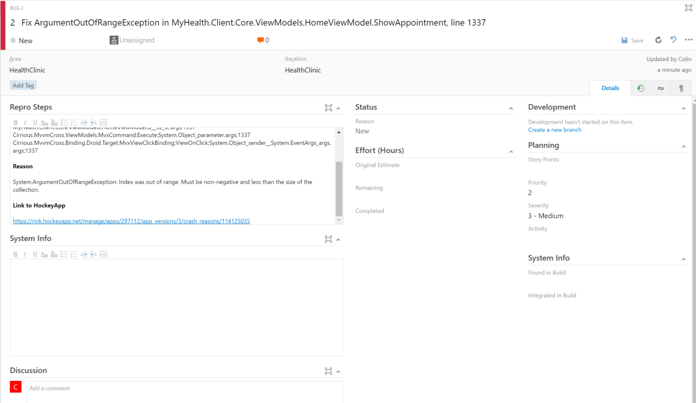
    
    _The VSTS Bug_
    
1. Make a note of the ID of the bug.
    
<a name="Ex5Task4"></a>
#### Task 4 - Fix the Bug ####

In this task you will fix the bug and release a new version simply by pushing the bug fix.
   
1. Fix the Bug In Visual Studio, open the solution and in the Solution Explorer navigate to **MyHealth.Client.Core\ViewModels\HomeViewModel.cs**. Double click it to open it.
    
    > **Note**: If you look at the Bug in VSTS or the ticket in HockeyApp, you will see that the crash occurred in the **ShowAppointment** method of the **HomeViewModel**.
    
1. Scroll to the bottom of the file to the **ShowAppointment** method. Uncomment the line of code that is commented out and delete the line directly after it so that the method looks as follows.
    
	````C#
	 private void ShowAppointment()
    {
        var parameters = new MvxBundle(new Dictionary<string, string>
        {
            ["appointmentId"] = SecondAppointment.AppointmentId.ToString(CultureInfo.InvariantCulture)
        });

        ShowViewModel<AppointmentDetailsViewModel>(parameters);
    }
    ````
    
1. In the Team Explorer navigate to the changes Window. Enter **Fixing ArgumentOutOfRangeException #2** in the comment and click **Commit and Push**.
    
    >**Note**: Your bug ID may not be 2 - use #x where x is the number of your bug. The #id notation tells VSTS to associate the work item with the id to this commit.
    
    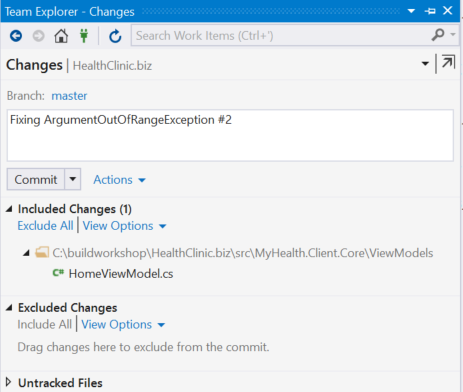
    
    _Fixing the ArgumentOutOfRangeException_
    
1. In VSTS, you can reject the latest release (since it caused an app crash). Navigate to the releases in the **RELEASE** hub and reject the latest release.
    
    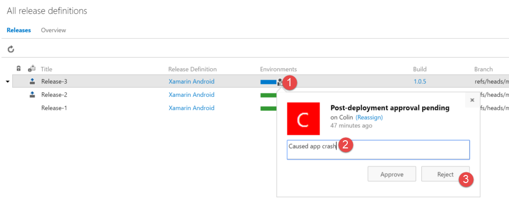
    
    _Reject the release_
    
1. After a few moments, a new release should become available. In the **BUILD** hub you can check on the progress of the latest build.
    
1. Update the App through HockeyApp Update Manager. To do this, in the emulator, stop the **Patients** app. Then start it again. This time you should see a notification that a new version of the app is available. This is made possible by the update manager.
    
1. Click **Show** to view details.
    
    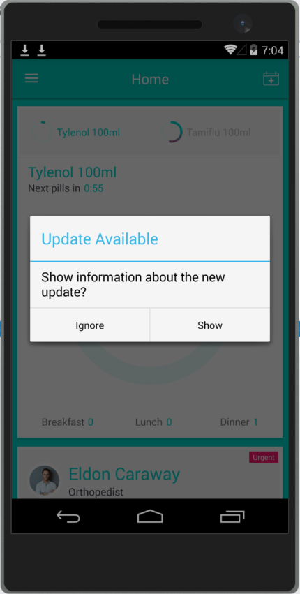
    
    _Update available for the app_
    
1. Once you have looked at the new version, you will have to exit the **Patients** app and uninstall it. This is because VSTS is signing the app with a temporary keystore. In a real application, you would sign with a private keystore and users would be able to update the app without first uninstalling.
    
1. Once you have uninstalled the app (as before), open HockeyApp and install the latest version.
    
1. Verify that the bug is fixed by running the **Patients** app. On the Home page, scroll down and click on the second appointment. Verify that the app no longer crashes and the appointment detail is displayed.
    
    
    
    _The crash has been fixed_
    
---

<a name="Summary" ></a>
## Summary ##

By completing this module, you should have:

- Created a HockeyApp account
- Created a VSTS Release Definition with a HockeyApp task
- Queued the Release manually and installed the app via HockeyApp in the emulator
- Tracked feedback from within the app
- Tracked app crashes from HockeyApp

> **Note:** You can take advantage of the [Visual Studio Dev Essentials]( https://www.visualstudio.com/en-us/products/visual-studio-dev-essentials-vs.aspx) subscription in order to get everything you need to build and deploy your app on any platform.
